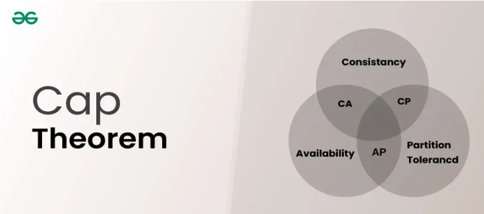
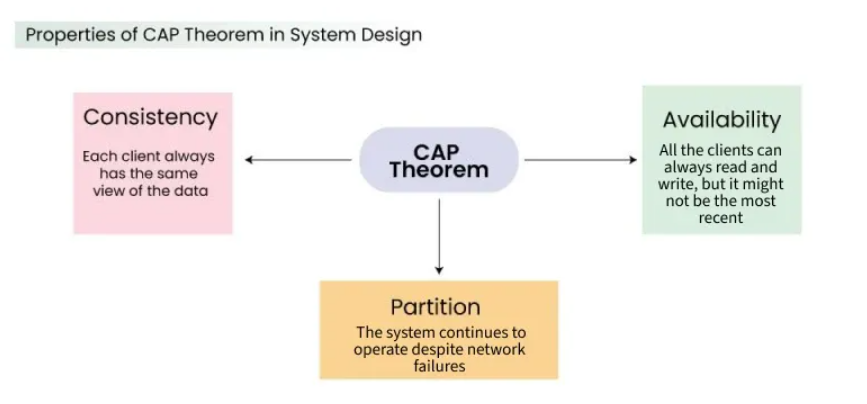
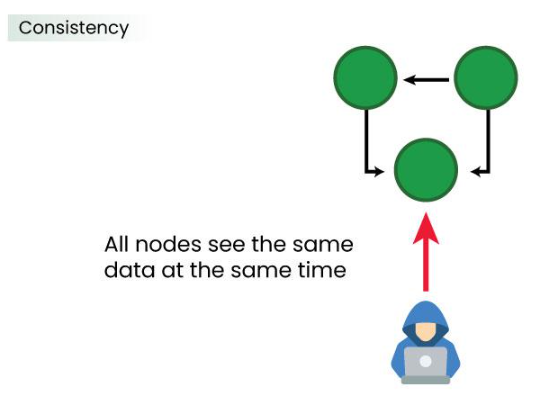
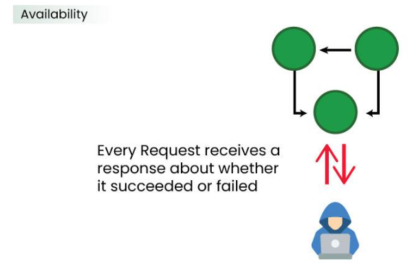
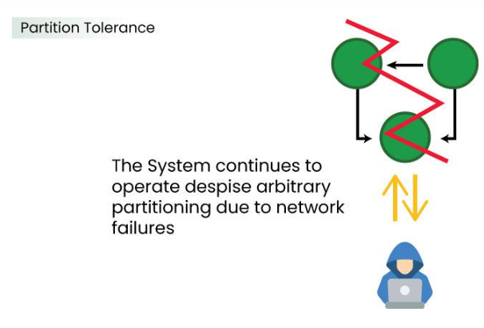

# CAP Theorem

The CAP Theorem is a fundamental concept in distributed systems. It states that a distributed system can guarantee only two out of three properties at the same time:

## 🔺 The Three Properties (CAP)

### 1. Consistency (C)

Every read gets the most recent write (or an error). Consistency defines that all clients see the same data simultaneously, no matter which node they connect to in a distributed system.

**👉 Think of it like:** all nodes always agree on the same data.

**Example:** After updating your bank balance, every ATM shows the same updated amount.

### 2. Availability (A)

Every request receives a response, even if it might not be the latest data.

- The system stays operational 100% of the time.
- No request is rejected.

**👉 Example:** A website always loads, even if some data is slightly outdated.

### 3. Partition Tolerance (P)

The system continues to function even if network failures occur (i.e., communication between nodes is broken).

**👉 Example:** If two servers can't talk to each other, the system still works somehow.

## 🧩 Simple Analogy

Imagine WhatsApp messages:

- **Consistency** → Everyone sees the same messages instantly
- **Availability** → You can always send messages
- **Partition tolerance** → Works even with poor network

**If the network is down (partition):**

- Either you wait (favor consistency)
- Or you send anyway and sync later (favor availability)