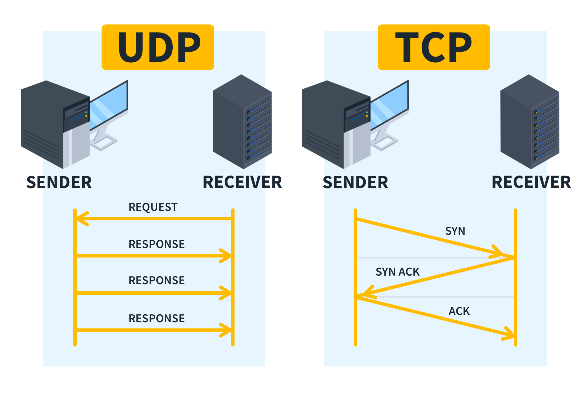

# APPLICATION-LAYER PROTOCOLS:

Application layer protocols are the set of rules and standards that applications (like your web browser, email client, or messaging app) use to communicate over a network — usually the internet.

When you open a website, send an email, or join a Zoom call, there are invisible agreements happening in the background about how to format data, how to start a conversation, and how to end it properly. Those agreements are the application layer protocols.

---

## Application Layer Protocols

| Abbreviation | Full Form | What it Does |
|-------------|----------|--------------|
| HTTP | HyperText Transfer Protocol | Loads web pages; used by browsers to communicate with servers. |
| HTTPS | HyperText Transfer Protocol Secure | Loads web pages securely using encryption (SSL/TLS). |
| FTP | File Transfer Protocol | Transfers files between computers. |
| SMTP | Simple Mail Transfer Protocol | Sends emails. |
| POP3 | Post Office Protocol Version 3 | Downloads emails from a server to a device. |
| IMAP | Internet Message Access Protocol | Manages emails directly on the server. |
| DNS | Domain Name System | Converts domain names into IP addresses. |
| SSH | Secure Shell | Securely accesses and manages remote systems. |

---

# Client-Server Model:

A client–server model is a system where clients send requests and servers respond by providing data or services over a network.

• The server is a powerful computer that provides services (like websites, files, apps).  
• The client is your device (like your phone or laptop) that requests something from the server.  

---

## How it works

• The client (like a web browser) sends a request  
• The server receives and processes the request  
• The server sends back a response  
• The client displays or uses the result  

---

## Characteristics

• control (server manages data)  
• Clients depend on server for resources  
• Easy to manage and secure data  

---

## Advantages

• Easy data management  
• Better security control  
• Centralized resources  

---

## Disadvantages

• Server failure affects all clients  
• Can become overloaded  
• Requires maintenance  

---

These protocols follow a central server that provides services to clients.

HTTP – Web browsing  
HTTPS – Secure web browsing  
FTP – File transfer  
SMTP – Sending emails  
POP3 – Downloading emails  
IMAP – Managing emails on server  
DNS – Domain name resolution  
SSH – Remote login (secure)  

---

# Peer-to-Peer (P2P) Model:

• Every device is equal — no strict "client" or "server."  
• Each device, called a peer, can both request and provide services.  

---

## Example

File sharing systems like BitTorrent  
Sharing files between computers on the same network  

---

## Key Features

No central server  
Direct communication between peers  
Distributed control  

---

## Advantages

No need for expensive servers  
Easy to set up  
If one peer fails, others still work  

---

## Disadvantages

Less secure compared to client–server  
Hard to manage and control  
Data can be unreliable (depends on peers)  

---

These protocols allow direct communication between devices (peers) without a central server.

BitTorrent – File sharing  
Gnutella – Decentralized file sharing  
eDonkey – File sharing network  
FastTrack – Used by apps like Kazaa  

---

# WebSocket:

WebSocket is a communication protocol that provides full-duplex (two-way) communication between a client and a server over a single, long-lived connection.

---

## How it works

Starts with an HTTP/HTTPS request (called a handshake)  
Connection is upgraded to WebSocket  
Client and server can send data anytime (both directions)  

---

## Features

Full-duplex communication (both sides talk at the same time)  
Persistent connection (stays open)  
Low latency (faster than repeated HTTP requests)  

---

## Uses / Examples

Live chat applications  
Online gaming  
Real-time notifications  
Stock price updates  

---

# The key difference

## Client–Server

✔ Client sends request → Server sends response  
✔ Communication is usually request–response  
✔ Server is the center  

---

## Peer-to-Peer (P2P)

✔ No central server  
✔ Each peer can send and receive directly  
✔ Every node acts like both client and server  

---

## WebSocket

✔ Both client and server can send messages anytime  
✔ Connection stays open (persistent)  
✔ Not limited to request → response  

---

# TRANSPORT-LAYER PROTOCOLS:

---

## 1. TCP (Transmission Control Protocol)

○ Reliable and connection-oriented.  
○ Guarantees the delivery of data packets in the correct order.  
○ If a packet is lost, TCP will request a retransmission until all data arrives correctly.  
○ Used by protocols like HTTP, FTP, Email.  
○ Example: When you browse a website, TCP ensures that all the data (images, text, etc.) comes to your browser in the right order.  

---

### ✨ How it works:

• Before any actual data is exchanged, there’s a 3-step handshake:  

1. Sender sends a SYN (synchronize) packet.  
2. Receiver responds with a SYN-ACK (synchronize-acknowledgment).  
3. Sender replies with an ACK (acknowledgment).  

---

### • Key points about TCP:

○ Connection-oriented: TCP ensures a reliable connection before data transmission begins.  
○ Reliable delivery: TCP guarantees that data will arrive intact and in order.  
○ Slower but dependable: More overhead due to checks and acknowledgments.  
○ Best for: Applications needing reliability (e.g., web browsing, email, file transfers).  

---

## 2. UDP (User Datagram Protocol)

○ Unreliable and connectionless.  
○ Doesn’t guarantee delivery or order, just sends the data as fast as possible.  
○ Useful for things where speed matters more than complete reliability.  
○ Used in protocols like DNS, VoIP (Voice over IP), and Streaming.  
○ Example: If you're watching a live stream or playing an online game, UDP might be used because a slight delay is more annoying than a single packet of data being lost.  

---

### ✨ How it works:

• Sender sends a Request.  
• Receiver sends back multiple Responses.  

---

### • Key points about UDP:

○ No connection establishment: UDP just sends data without setting up a formal connection.  
○ No guarantees: There's no guarantee that the data will arrive or arrive in order.  
○ Lightweight and fast: Because it skips steps like handshakes, it’s faster but less reliable.  
○ Best for: Applications where speed matters more than reliability (e.g., video streaming, online gaming).  

