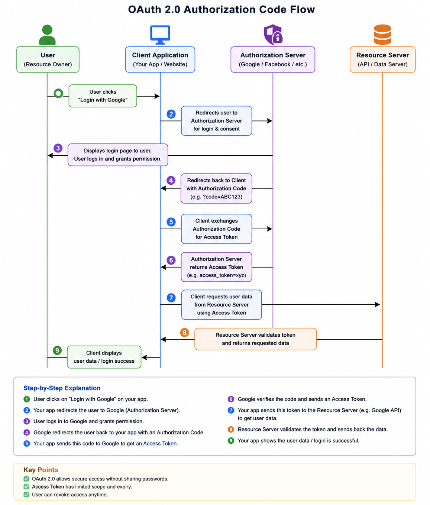
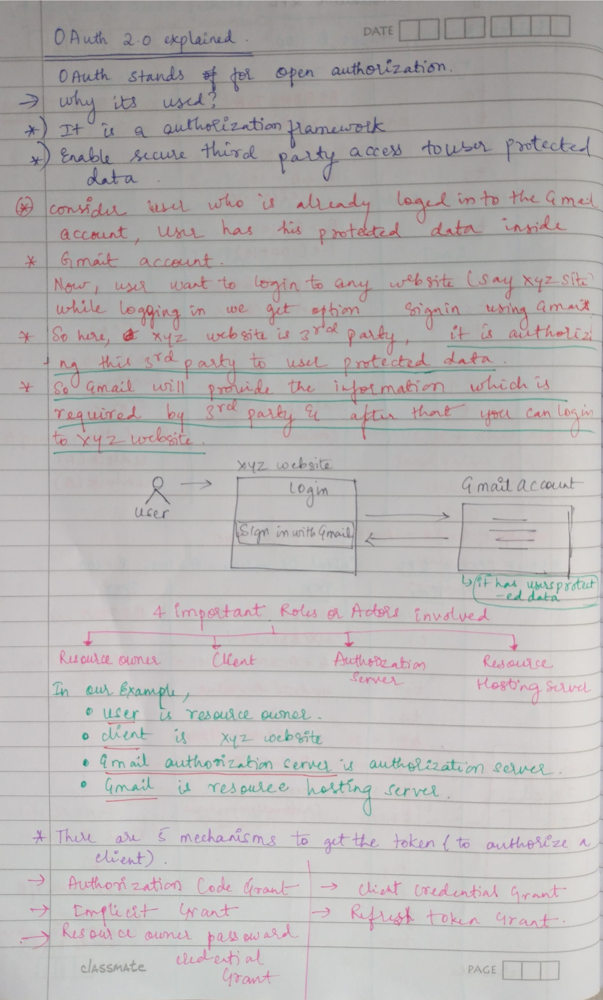
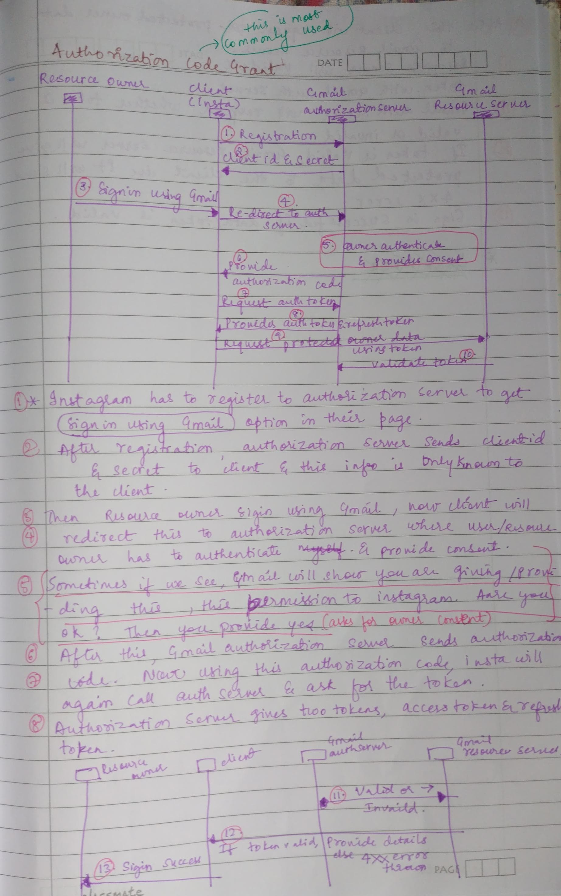
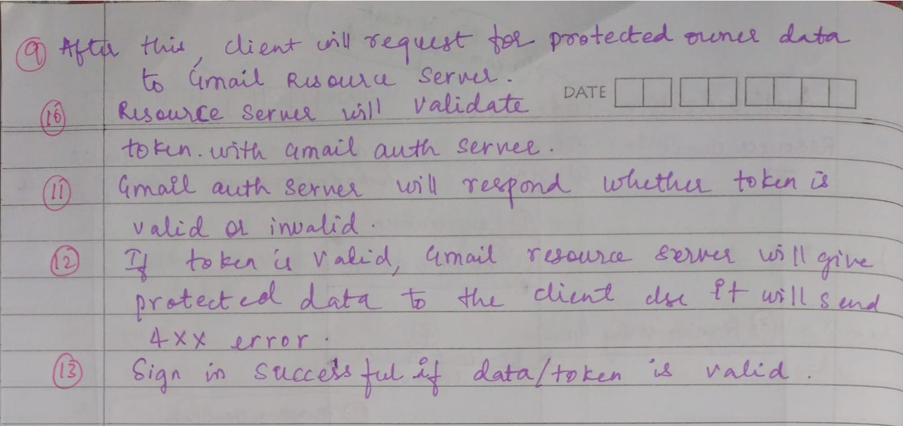

# OAuth 2.0

OAuth 2.0 (pronounced "oh-auth two") is an authorization framework that allows third-party applications to access a user's data without exposing their password. It is widely used in modern web and mobile apps — like "Login with Google" or "Connect with GitHub".

OAuth 2.0 makes login easier because instead of:

- creating a new account for every website
- remembering many usernames and passwords

you can simply use:

- “Login with Google”
- “Login with Facebook”
- “Login with Apple”

The website never sees your actual password.  
It only gets permission from Google/Facebook/Apple to verify who you are.

So OAuth 2.0 helps with:

- Easier login
- Better security
- Fewer passwords to remember
- Faster sign-up/sign-in experience

---

# Main Components of OAuth 2.0

- **User** → Person using the application
- **Client/Application** → App requesting access
- **Authorization Server** → Verifies user and gives token
- **Resource Server** → Stores user data
- **Access Token** → Temporary key used to access data

---

# OAuth 2.0 Flow

1. User clicks Login with Google
2. App redirects user to Google login
3. User gives permission
4. Google sends access token
5. App uses token to access user data

---

# Architecture Diagram

<p align="center">
  
</p>

---
# Why not directly give Access Token? Why first authorization code is exchanged?

Because the authorization code is like a:

- temporary proof
- short-lived token

that the user approved access.

But it is **NOT** the real access key.

---

# The App Must Prove Its Identity

The app must still prove:

> “I am the real Instagram app.”

using:

- Client ID
- Client Secret

Only after verification does Google issue the real **Access Token**.

---

# Why Not Directly Send Access Token?

If Google directly gave the access token in browser redirect:

```text
Google → Browser URL → Access Token
```

then:

- hackers could steal it
- browser history may store it
- malicious apps could misuse it

So OAuth first sends a temporary authorization code instead of the real access token.

---

# Authorization Code Exchange Flow

When the client receives the authorization code from the authorization server, it sends:

- Authorization Code
- Client ID
- Client Secret

to the authorization server.

The server then verifies:

- Is this the real client?
- Is the authorization code valid?

After successful verification, the authorization server provides:

- Access Token
- (sometimes Refresh Token)


---
# Step-by-Step Simple Explanation

## Step 1 — Instagram registers with Google

Before using “Login with Google”:

Instagram must first tell Google:

> “I am a valid application.”

Google then gives:

- Client ID
- Client Secret

Think of these like:

- App username
- App password

This happens only once during setup.

---

## Step 2 — Google gives Client ID & Secret

Google sends:

- Client ID
- Client Secret

Only Instagram knows this secret.

This is used later for security.

---

## Step 3 — User clicks “Sign in with Google”

You open Instagram and click:

> “Continue with Google”

---

## Step 4 — Instagram redirects user to Google

Instagram sends you to Google login page.

Because:

- Google should verify your password
- Instagram should never see your password

---

## Step 5 — User logs in & gives consent

Now Google asks:

> “Do you allow Instagram to access your profile/email?”

You click:

- Allow / Yes

This is called:

# Consent

You are giving permission.

---

## Step 6 — Google sends Authorization Code

After permission:  
Google sends Instagram a temporary code.

Example:

```text
AUTH_CODE_123
```

This code is short-lived.

---

## Step 7 — Instagram asks for Access Token

Instagram now sends:

- Authorization code
- Client ID
- Client Secret

to Google.

Google checks:

- Is Instagram real?
- Is code valid?

---

## Step 8 — Google sends Tokens

Google returns:

- Access Token
- Refresh Token

### Access Token

Used to access user data.

### Refresh Token

Used to get new access tokens later.

---

## Step 9 — Instagram requests user data

Instagram now asks Google:

> “Give me this user's profile information.”

It sends the access token.

---

## Step 10 — Google validates token

Google checks:

- Is token valid?
- Is token expired?
- Does it have permission?

If valid:

- Google sends user data.

---

## Step 11 — Google resource server says Valid/Invalid

If token valid:  
✅ Data allowed

If invalid:  
❌ 401 Unauthorized Error

---

## Step 12 — Instagram gets user details

Instagram receives:

- Name
- Email
- Profile info

---

## Step 13 — Login successful

Instagram logs you in successfully.

No new password needed.

---

# Hand written notes

<p align="center">
  
</p>

<p align="center">
  
</p>

<p align="center">
  
</p>