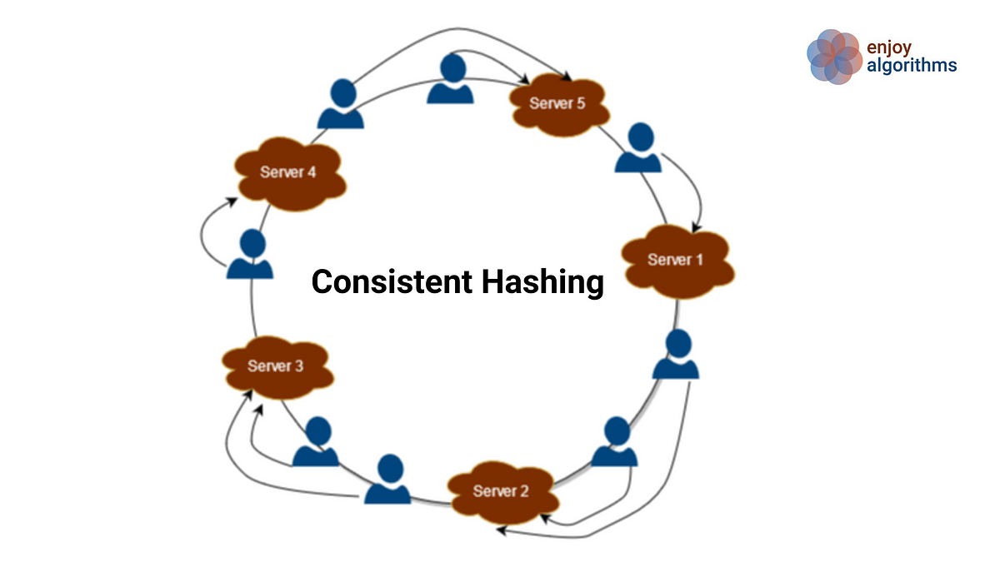
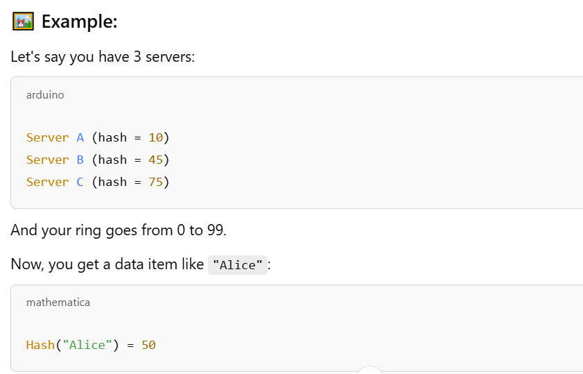
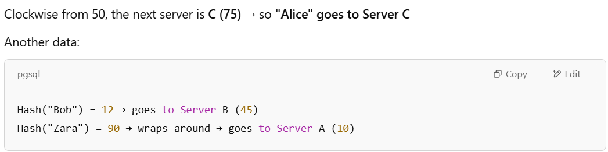
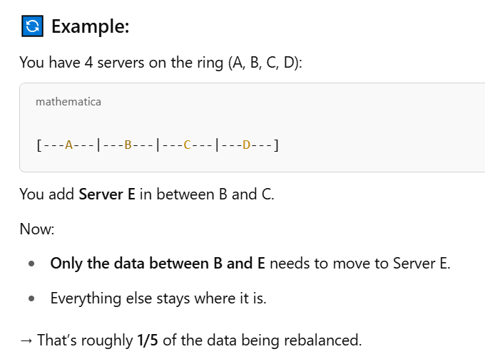
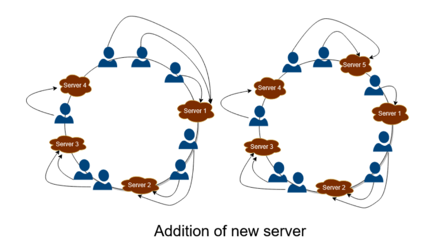
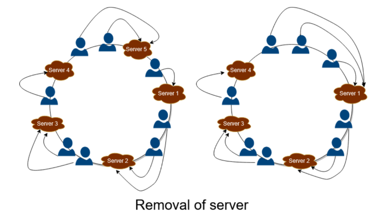
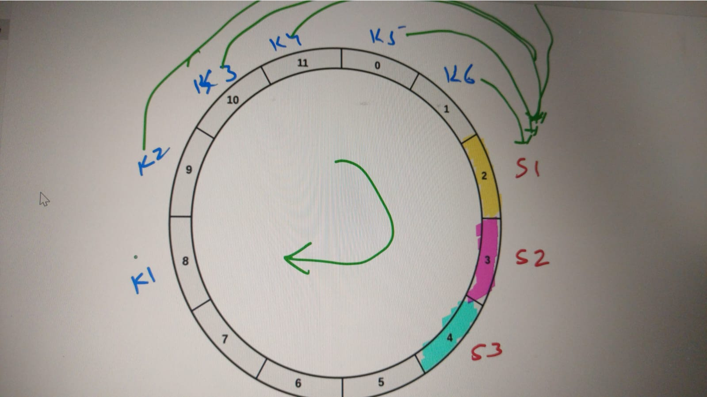
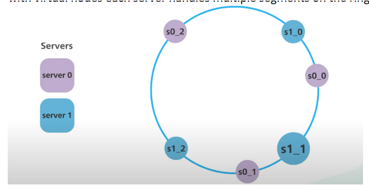
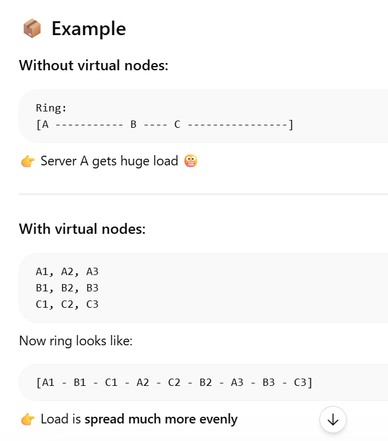
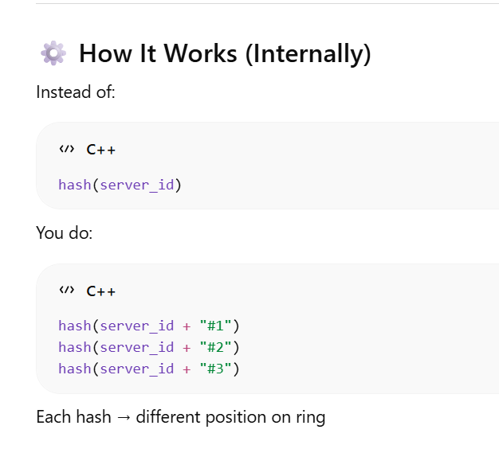

## 🧠 What Is Consistent Hashing?

Consistent Hashing is a smart way to distribute data or traffic across servers so that:
1. Load is balanced evenly  
2. When you add or remove a server, you don’t have to move all data  
3. It's perfect for scalable systems (like databases, caches, or microservices)  

---

## 🧮 The Basic Idea

Imagine a circle (called a virtual hash ring).

- You place servers on this ring using a hash function  
- You also hash each data item (key) (like a username) to a point on the ring  

📦 **Rule:**  
Each key is stored in the first server you reach by going clockwise on the ring.

  

---

## ❓ Clarification

It goes to the server which comes first when it moves in clockwise direction from its hash value?  

✅ **Answer: Yes.**
- You hash the key.  
- Starting from that hash value, move clockwise on the ring.  
- The first server you encounter is the one responsible for that key.  

  

  

---

## 🔄 What Happens When a New Server Is Added?

When you add a new server:
- Only some keys need to move — specifically, the keys that now hash to a location between the new server and its predecessor on the ring.

🔢 So yes:  
If you have n total servers, adding one new server means roughly **1 / (n + 1)** of the total keys will move to the new server.

🧠 This is much better than mod hashing, where almost all keys might move when n changes.

  

---

## 🔄 When You Add a Server

✅ **What Happens:**
1. The new server is hashed onto the ring (at a specific point).  
2. It becomes responsible for some part of the keyspace — specifically the keys between its position and its predecessor on the ring.  
3. Only those keys (in that region) need to move to the new server.  

📦 **Result:**  
Only a small fraction (~1 / total_servers) of data is rebalanced.

  

---

## ❌ When You Remove a Server

✅ **What Happens:**
1. The server is removed from the ring.  
2. Its keyspace is reassigned to the next server clockwise on the ring.  
3. Only the keys that belonged to the removed server are affected.  

📦 **Result:**  
Again, only a fraction of the keys (those handled by the removed server) need to be moved — not all keys.

  

---

## ❗ What is the limitation of this consistent hashing?

  

- The problem with this type is if some server fails then more load will go to single / next server in clockwise direction. So one server might get lots of load.  
- Or if all servers that are placed next to next fails, then all load will just go to the one server. (as shown in above image)  
- To overcome this, virtual server/virtual nodes concepts arrives.  
- In the below service we have two service , each have three virtual nodes . Instead of having s0 and s1. we have s0_0, s0_1,s0_2 and s1_0,s1_1,s1_2. with virtual nodes each server handles multiple segments on the ring.  

  

---

## 🔴 The Problem Without Virtual Nodes

In consistent hashing, you:

- Hash servers onto a ring  
- Hash keys onto the same ring  
- Each key goes to the next server clockwise  

👉 Sounds good, but here’s the issue:

If you have only a few servers:

- Some servers get huge chunks of the ring  
- Some get very small chunks  

➡️ Result: uneven load distribution  

---

## ✅ Solution: Virtual Nodes

Instead of placing each server once on the ring…

👉 You place each server multiple times (with different hashes)

These multiple positions are called virtual nodes

  

---

## ⚙️ Virtual Node Placement

each virtual node uses same hash function, but with different keys  

👉 Same hash function  
👉 Different input strings → different hash outputs → different positions  

---

## 📍 Are They Evenly Placed?

⚠️ Important nuance:

- Not perfectly evenly spaced  
- But statistically well distributed  

Why?  
Because a good hash function gives uniform distribution  

  

---
## Important note :
Both physical servers and their virtual nodes are placed on the hash ring using the same hash function. Virtual nodes are created by hashing the server identity with different suffixes, resulting in multiple positions for a single physical server. They (Server/ Vnodes) are not placed randomly—each position is deterministically computed using the hash function, and then mapped onto the ring based on the hash value.