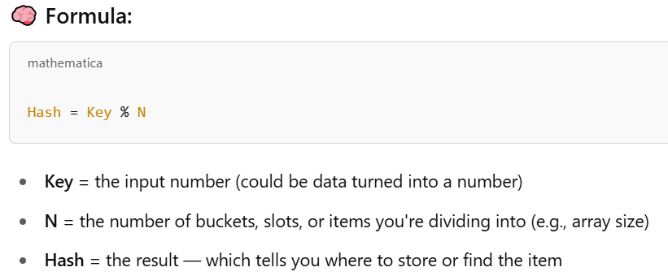
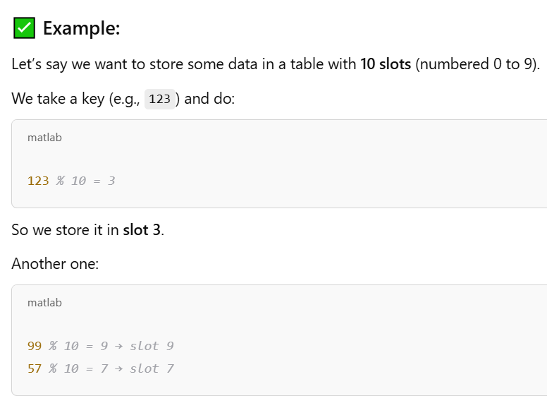
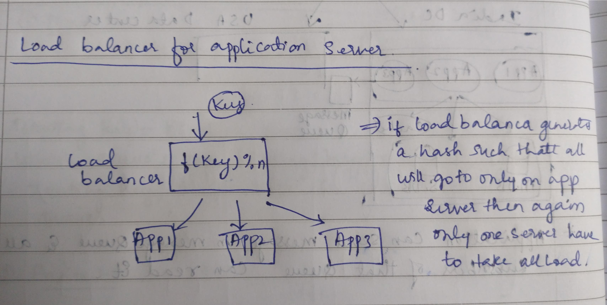
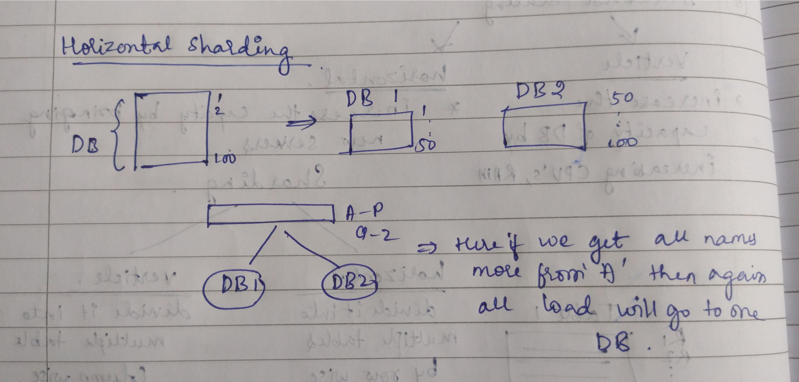

## Consistent Hashing

Hashing is a process used in computer science to convert input data of any size into a fixed-size string of characters, usually a sequence of numbers and letters. This output is called a hash value.

**Hashing = Input + Formula → Hash Value (Output)**

### Summary (in plain words)
- You give some input (like text, a file, a number).
- The computer uses a special formula (called a hash function).
- It creates a unique-looking output (called a hash value).
- That output is always the same for the same input.
- But if you even slightly change the input, the output changes a lot.

---

## Mod Hashing

Mod Hashing (short for Modulo Hashing) is a simple hashing technique.  
You take your input (usually a number), and you use the modulo operator (%) to get a value within a certain range.

  

  

---

## Limitations of Mod Hashing

### 1. Not Flexible When Size Changes
- If the number of slots (N) changes (like from 10 to 11), all the hash values change.
- This means you’d have to reassign everything, which is very inefficient.

### 2. Clustering / Collisions
- Two different keys can end up in the same slot:
    123 % 10 = 3
    113 % 10 = 3
- This causes collisions which need extra work to resolve (like chaining or probing).

### 3. Poor Distribution if N is not well chosen
- If N is not a prime number, or the data has patterns, the hash may not spread evenly, and many items could cluster in a few slots.

---

## 🎯 Context: Load Balancer + App Servers

Imagine a load balancer that uses mod hashing to decide which application server handles each user request:
Server = hash(user_id) % N

Where:
- `user_id` is the input (like 101, 102, 103...)
- `N` is the number of app servers

The result decides which server handles the request.

  

---

## ❌ Problem: Poor Distribution

### ⚠️ What goes wrong?

#### 1. Non-Prime N Causes Patterns

Let’s say:
- `N = 10` (not a prime)
- `user_id` values go from 100 to 199

So:
100 % 10 = 0
101 % 10 = 1
...
109 % 10 = 9
110 % 10 = 0
This looks okay at first. But if user_ids are all even numbers (100, 102, 104...):
100 % 10 = 0
102 % 10 = 2
104 % 10 = 4
106 % 10 = 6
Now only half the servers get used (0, 2, 4, 6, 8).  
The other half (1, 3, 5, 7, 9) get no traffic. That’s bad load balancing.

---

That’s another real and important limitation in simple sharding strategies — especially when data is not evenly spread.

- **Sharding** is database level (database splitting)
- **Partitioning** is data partition

---

## 🗃️ Scenario

You have two databases:
- DB1 stores names from A to P
- DB2 stores names from Q to Z

### 🔄 How it works:

You might use the first letter of the name to decide which DB to use:
if name starts with A to P → store in DB1
if name starts with Q to Z → store in DB2
---

  

## ❌ Problem: Uneven Data Distribution

Let’s say your users mostly have names like:
- Alice  
- Ankit  
- Amit  
- Abdul  
- Arun  

(see the pattern? All starting with A)

Now:
- DB1 is getting all the load  
- DB2 is almost idle  