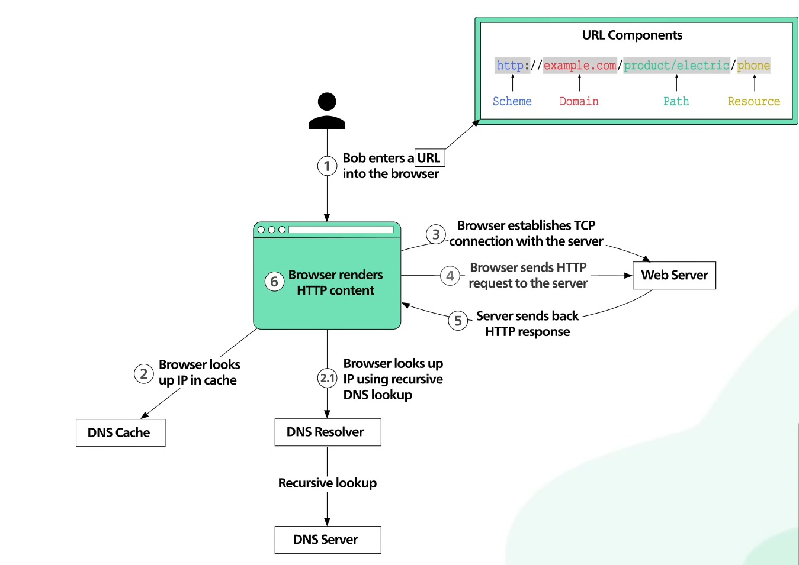

# Domain Name Server - DNS

Computers on the internet communicate using IP addresses (e.g., 142.250.190.78).  
But humans prefer names like google.com.  
The Domain Name System (DNS) is like the phonebook of the internet: it translates human-friendly names into machine-friendly IP addresses.

---

## DNS Hierarchy

DNS is structured like a tree with several levels:

- **Root servers** → The top of the hierarchy. They don’t store domain names directly but direct queries to the right TLD servers.  
- **TLD servers** → Manage information for domains under a top-level domain like .com, .org, .net. They point to the authoritative servers for each domain.  
- **Authoritative servers** → Hold the actual DNS records (A, AAAA, MX, etc.) for a domain.  

---

## DNS Resolution Process (Step by Step)

When you type `www.example.com` into a browser:

1. **Browser Cache Check**  
   - Your browser first checks if it already knows the IP (from a previous visit).

2. **OS Cache Check**  
   - If the browser doesn’t know, it asks your operating system’s DNS cache.

3. **Recursive Resolver (DNS Resolver)**  
   - If your OS doesn’t know, it asks a DNS resolver (usually your ISP’s DNS or public DNS like Google 8.8.8.8, Cloudflare 1.1.1.1).  
   - This resolver is responsible for finding the answer by querying the DNS hierarchy.

4. **Root Server Query**  
   - Resolver asks a root server: “Where is .com TLD?”  
   - Root replies with the address of .com TLD servers.

5. **TLD Server Query - Top-Level Domain server**  
   - Resolver asks a .com TLD server: “Where is example.com?”  
   - TLD replies with the authoritative name server for example.com.

6. **Authoritative Server Query**  
   - Resolver asks example.com’s authoritative server: “What is the IP of www.example.com?”  
   - Authoritative server replies: 93.184.216.34.

7. **Return Answer**  
   - Resolver returns this IP to your browser.  
   - Browser connects to 93.184.216.34 (the web server) and loads the page.

8. **Caching**  
   - To speed up future lookups, the answer is cached at multiple levels:
     - Browser cache  
     - OS cache  
     - Resolver cache  
   - Cache expiration is controlled by the TTL (Time To Live) field in DNS records.

---

## Example Walkthrough

🌐 Suppose you type:  
`www.google.com`

### 1️⃣ Root Server

👉 You ask:  
“Where can I find .com domains?”

👉 Root server replies:  
- “Go ask this TLD server for .com”  

📦 **What you get:**  
- IP addresses of .com TLD servers  

---

### 2️⃣ TLD Server (.com)

👉 You ask:  
“Where is google.com?”

👉 TLD server replies:  
- “Go ask this authoritative DNS server for google.com”  

📦 **What you get:**  
- IP address of authoritative name server for that domain  

---

### 3️⃣ Authoritative DNS Server

👉 You ask:  
“What is the IP of www.google.com?”

👉 It replies:  
- “Here is the actual IP”  

📦 **What you get:**  
- Final IP address (like 142.250.x.x)

---

## After DNS → TCP Handshake

After DNS gives you the IP address, the next step is:

🔗 **TCP Handshake (connection setup)**

Now your browser knows:

www.google.com
 → 142.250.x.x

It wants to connect to that server (usually on port **80 for HTTP** or **443 for HTTPS**).

---

## 🤝 3-Way TCP Handshake

Before sending any data, client and server establish a connection:

### 1️⃣ SYN
Client → Server  
“Hey, I want to connect”

### 2️⃣ SYN-ACK
Server → Client  
“Okay, I’m ready”

### 3️⃣ ACK
Client → Server  
“Great, let’s start”

---

## 📦 After Handshake

Now the connection is established:

- Browser sends HTTP request (e.g., `GET /`)  
- Server sends back HTML, CSS, JS  
- Page loads  

---

## 🖼️ Diagram

