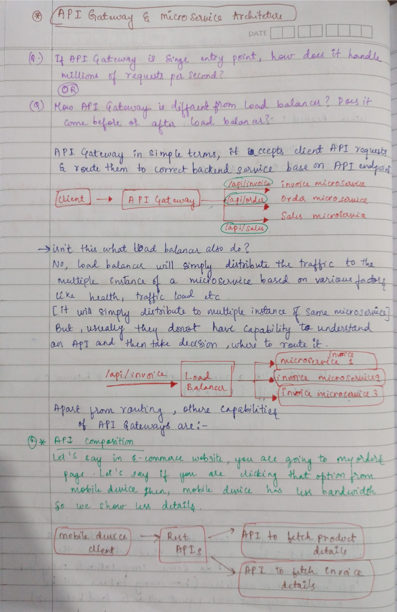
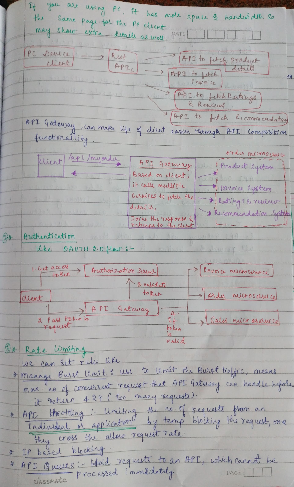
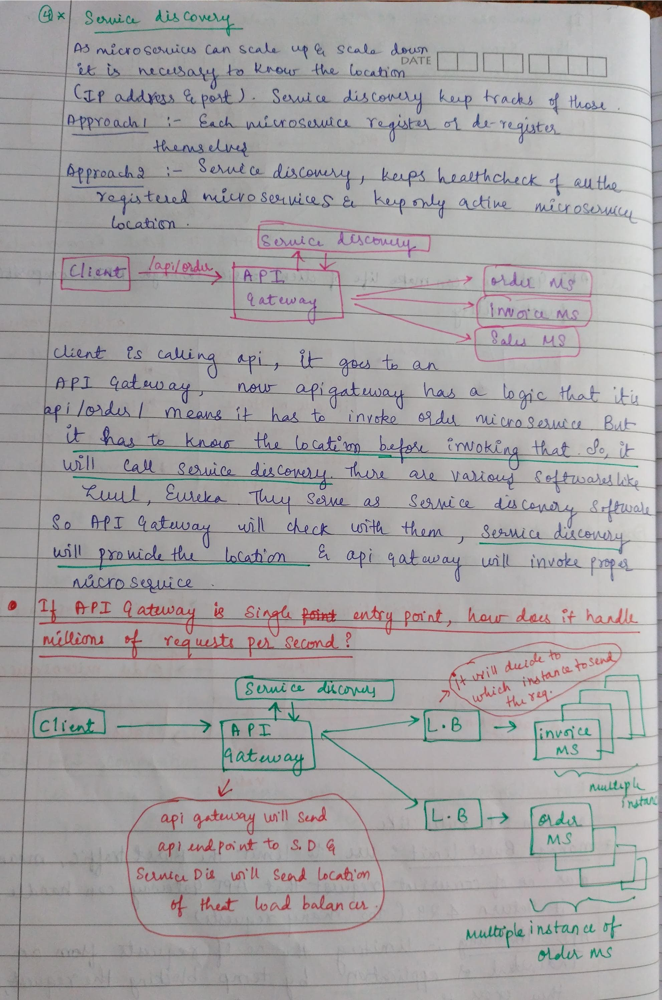
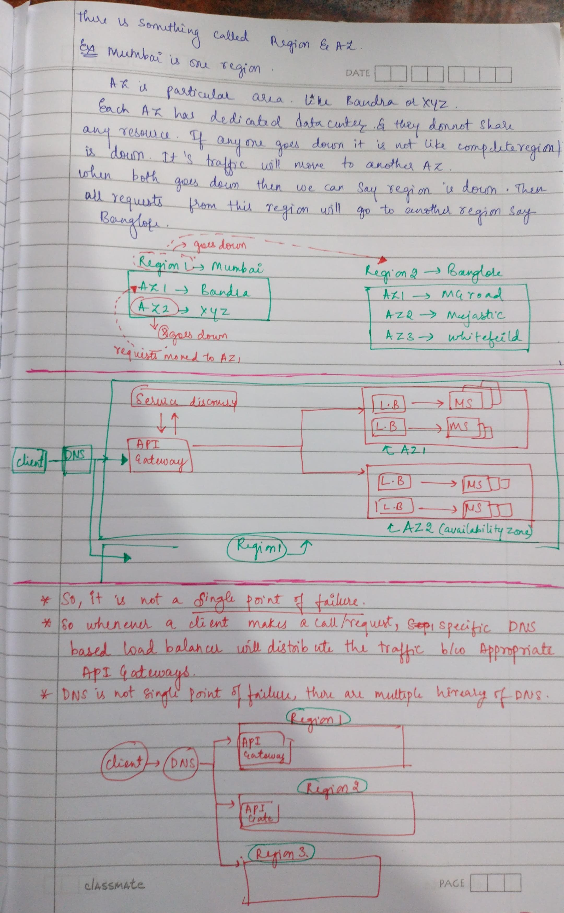

# What is an API and how it is designed?

## API --> Application Programmable Interface

API (Application Programming Interface) is a way for different software programs to communicate and share information.

* For example, if you are writing a code to sort integers and someone comes and tell you that they want to buy your library but they don’t know how to interact with this library.
  An API is documented way in which external consumer can understand how they can interact with your code but not how your code works. They can just interact with your code.

* API is a function that external people can call and it is just a contract, not how you are going to do it, but what it is going to do.

---

# Simple Example

When you order food using an app:

* The app sends your order to the restaurant using an API.
* The restaurant sends back the order details through the API.

So, the API works like a messenger between two systems.

---

# Best Practices to Design an API

* Naming an API properly is important.

* Parameters defining. Don’t take additional parameters unless they are necessary.
  That action which we are doing should define a name and should define a parameter.
  That means naming and parameters should be given such that it is relevant to what action we are performing using an API.

* Response object defining. Lots of people stuff lots of information in response and give it to a caller but this is bad API design because:

  * it is giving more information to user than required
  * it requires more network usage
  * it becomes more confusing

* Error defining. When you are defining error think about common expectations and responsibility your API has.
  Suppose you are passing a parameter which should be string and if user passes integer there you no need to define separate function to check if it is string or not and throw error, instead you can just pass/define input as string when you are passing a parameter.

---

# API Gateway

An API Gateway is a single entry point for all client requests in a system with multiple backend services.

Instead of clients calling many services directly, they call the API Gateway first.

### Without API Gateway
```
Mobile App
   |----> User Service
   |----> Payment Service
   |----> Order Service
   |----> Notification Service
```

### Problem:

client must know all services , it is complex and hard to manage ,security duplicated everywhere.

### With API Gateway
```
Mobile App
      |
   API Gateway
   /    |     \
User  Payment  Order
Svc     Svc     Svc
```
### Now:

client talks to only ONE endpoint and gateway routes requests internally

---

# Simple Way to Understand

Think of an API Gateway like a security guard and traffic manager for APIs.

Instead of users talking directly to many servers:

1. All requests first go to the API Gateway.
2. The gateway checks the request.
3. Then it sends the request to the correct service.
4. Finally, it returns the response to the user.

---

# What an API Gateway Does

* **Authentication** → checks if the user is allowed
* **Routing** → sends requests to the right service
* **Security** → protects backend services
* **Rate limiting** → controls too many requests
* **Load balancing** → distributes traffic

---

# NOTES

<p align="center">
  
</p>

<p align="center">
  
</p>

<p align="center">
  
</p>

<p align="center">
  
</p>