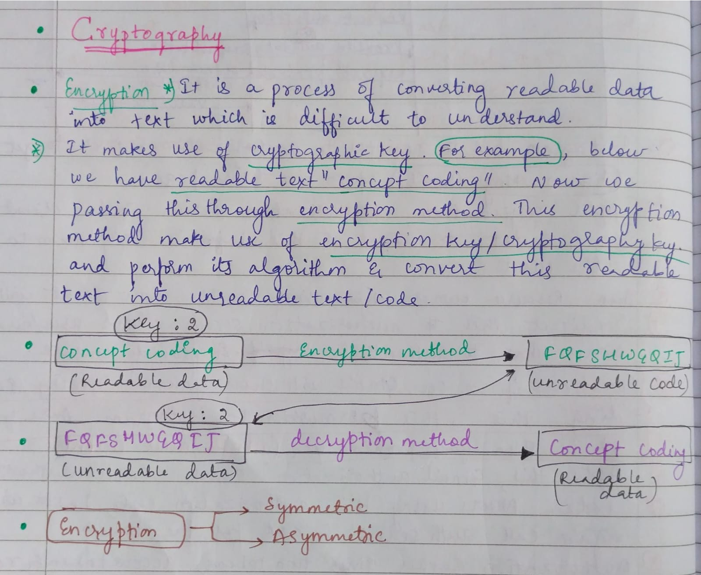
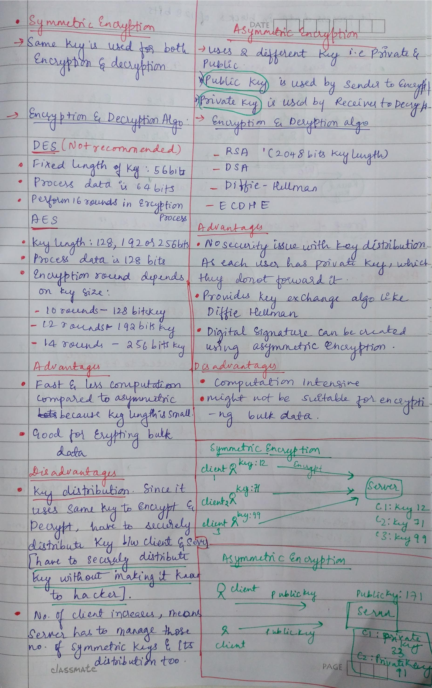
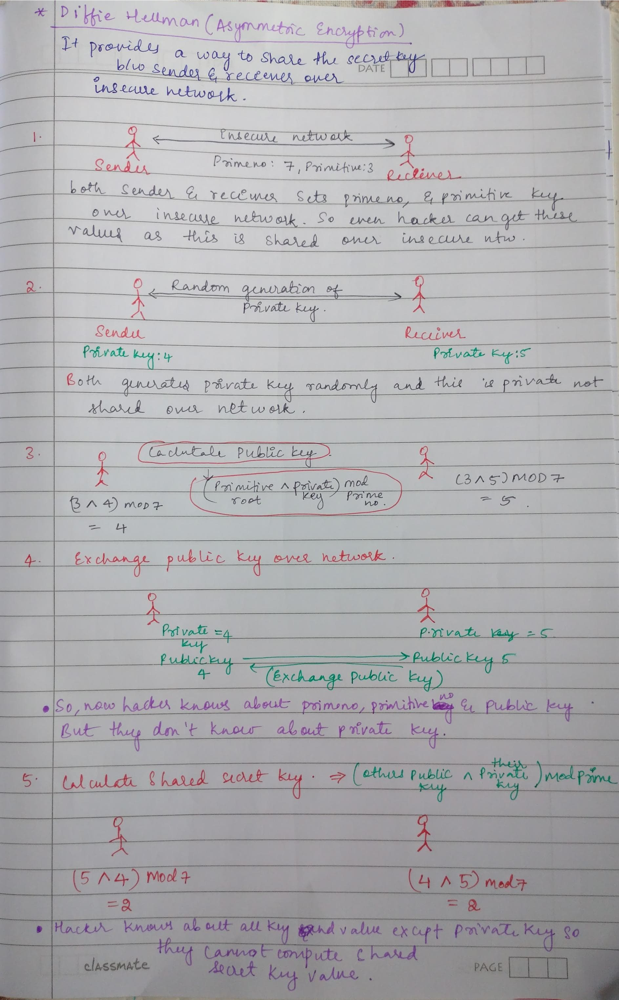

# 🔐 Symmetric vs Asymmetric Encryption
`Hashing` = converting data into a fixed-size value using a one-way function.
**Key points:**
- One-way → you normally cannot get the original data back from the hash.
- Same input → same hash.
- Tiny change in input → completely different hash.
- Mainly used for password storage, data integrity, checksums, etc.

`Encryption` = converting readable data (plaintext) into unreadable data (ciphertext) using an algorithm and a key, so it can later be decrypted.
- Encryption is reversible if you have the appropriate key.

---

## 🔐 Symmetric Encryption

Uses **one same key** for both encryption and decryption.  
Both sender and receiver share the same secret key.

### 📌 Example
You lock a box with a key 🔑 and send it to someone who uses the same key to open it.

### 🧱 Common Algorithms
- AES
- DES (older)
- ChaCha20

### ✅ Pros
- Fast
- Good for large data encryption

### ❌ Cons
- Key sharing is risky
- If key is leaked, security is broken

---

## 🔑 Asymmetric Encryption

Uses **two different keys**:
- Public Key (for encryption)
- Private Key (for decryption)

### 📌 Example
- Anyone can lock a box using your public key 🔓
- Only you can open it using your private key 🔐

### 🧱 Common Algorithms
- RSA
- ECC (Elliptic Curve Cryptography)
- ElGamal

### ✅ Pros
- More secure key exchange
- No need to share private key

### ❌ Cons
- Slower than symmetric encryption

---

## 🔄 Symmetric vs Asymmetric Encryption

| Feature | 🔐 Symmetric Encryption | 🔑 Asymmetric Encryption |
|--------|--------------------------|---------------------------|
| Keys Used | One shared secret key | Public + Private key |
| Encryption | Same key used | Public key used |
| Decryption | Same key used | Private key used |
| Key Sharing | Must be shared securely | Public key can be shared openly |
| Security Risk | If key leaks → insecure | Private key remains safe |
| Speed | Fast | Slower |
| Use Case | File encryption, disk encryption | HTTPS, email encryption, key exchange |

---

## 🔐 Symmetric Encryption Process

1. Key Generation: Alice and Bob share a secret key  
2. Encryption: Alice encrypts message using shared key  
3. Transmission: Encrypted message sent to Bob  
4. Decryption: Bob decrypts using same key  
5. `A secret key is generated by one party` ,it means either Alice or Bob (or a trusted server/system) can generate the secret key.

🧱 Tools: AES, DES, ChaCha20  

---

## 🔑 Asymmetric Encryption Process

1. Key Generation: Bob creates public/private key pair  
2. Public Key Sharing: Bob shares public key with Alice  
3. Encryption: Alice encrypts message using public key  
4. Transmission: Message sent to Bob  
5. Decryption: Bob decrypts using private key  
6. RSA-style asymmetric encryption: Receiver generates the public/private key pair, shares the public key, and keeps the private key secret.

🧱 Tools: RSA, ECC, ElGamal  

---

  

  

  

