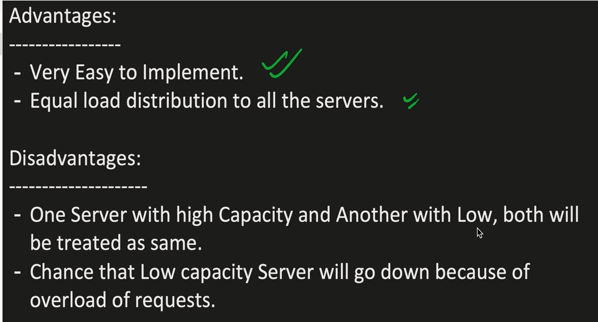
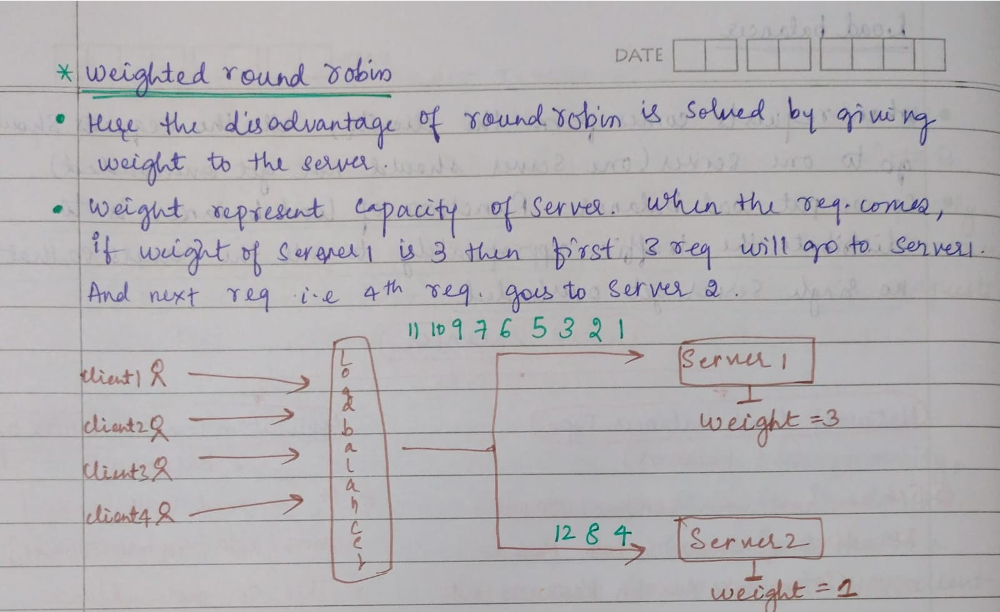
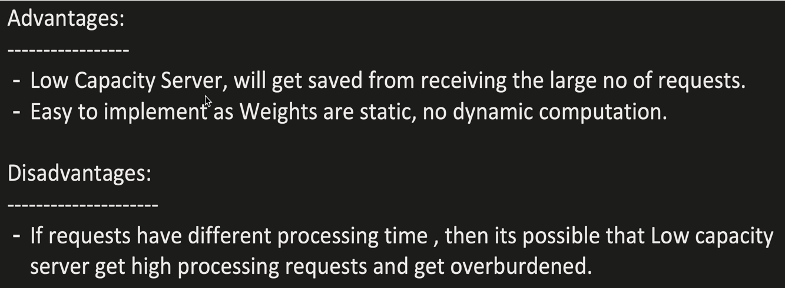
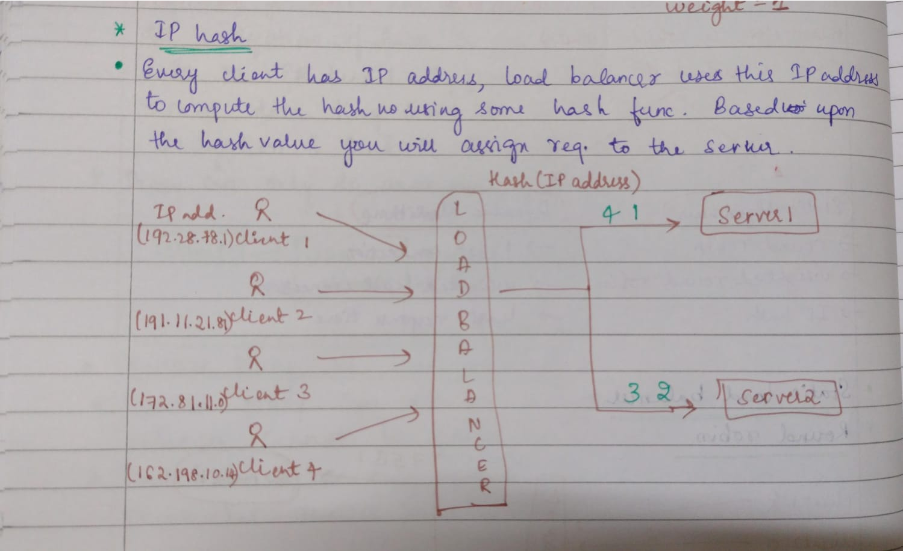
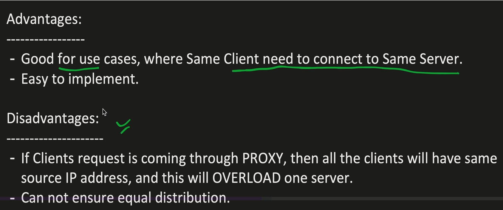
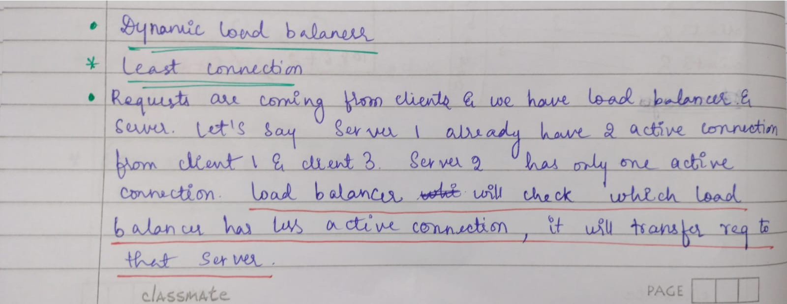
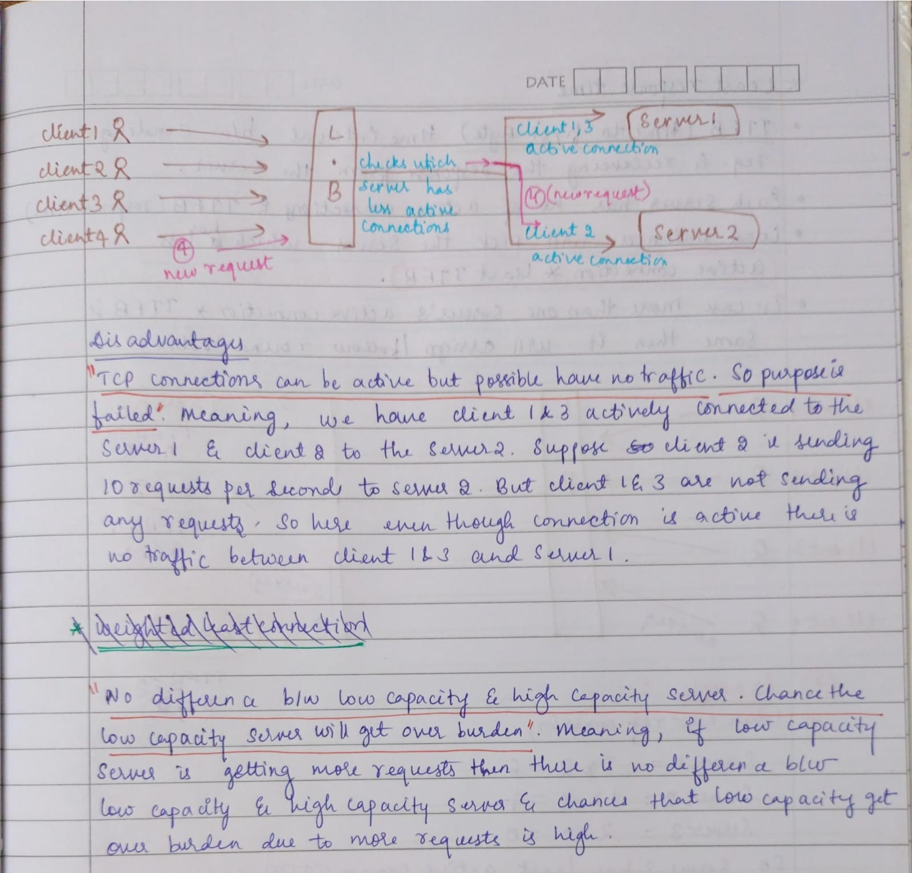
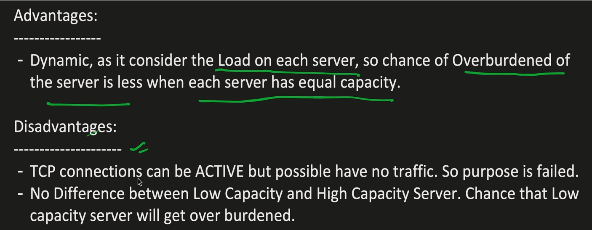
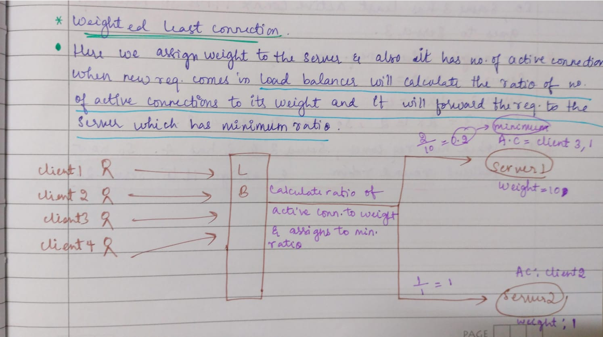
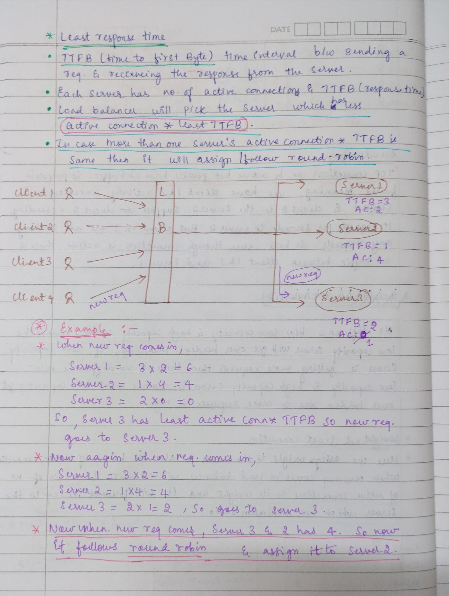

Consistent hashing and a load balancer are related concepts but not the same thing. Here's the difference:

🔄 Consistent Hashing ≠ Load Balancer  
But it can be used as part of a load balancing strategy.

---

## ✅ What is Consistent Hashing?
Consistent hashing is an algorithm used to distribute data or requests across multiple nodes (servers) in a way that minimizes reorganization when nodes are added or removed.  
• Used in distributed systems, like caching (e.g., Memcached, Redis clusters) or sharded databases.  
• Helps maintain balance without reshuffling everything.  
• It’s stateless — the decision about where to send data depends only on the hash.

---

## ✅ What is a Load Balancer?
A load balancer is a service or tool that distributes client requests across multiple backend servers.  
• Uses strategies like round-robin, least connections, or IP hash.  
• Can use consistent hashing as one strategy to route traffic predictably.

---

## 🔧 How Are They Related?
• Consistent hashing can be used by load balancers (especially Layer 7) to route requests based on a hash of something like:  
  ○ User ID  
  ○ Session ID  
  ○ IP address  
• This helps in session persistence (a user always goes to the same server).

---

## 🔑 TL;DR
• Consistent hashing is an algorithm.  
• Load balancer is a component that can use that algorithm.  
They serve different purposes but can work together in distributed systems.

---

