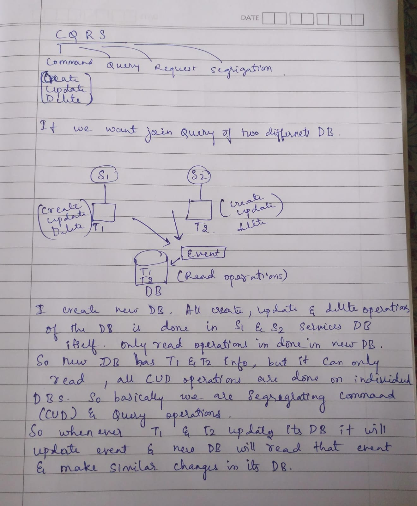

# CQRS (Command Query Responsibility Segregation)

---

# 🧠 What is CQRS?

CQRS is a pattern where you separate the parts of your system that handle:

- 📥 **Commands → Write operations**
  (Create, Update, Delete)

- 🔍 **Queries → Read operations**
  (Get, Search, Fetch data)

Instead of one system doing both reads and writes, you split them.

---

# 🔥 Core Idea

> One model for writing data  
> Another model for reading data

---

# 🧱 Traditional Approach (Monolith or Simple Service)

Same model handles:

- Read
- Write

Problems:

- Complex queries
- Slow joins
- Hard scaling
- Read and write compete for same DB load

---

# 🚨 The Real Problem in Microservices

Each service has its own database.

So you cannot easily do joins like:

- Orders DB
- Users DB
- Products DB

Example problem:

You want:

```text
Order + User Info + Product Details
```

But:

- Orders → Order DB
- Users → User DB
- Products → Product DB

❌ No direct SQL join possible across services

---

# ✅ How CQRS Solves This

CQRS introduces a separate:

> 🔹 Read Model (Query Side)

This is:

- pre-built
- pre-joined
- denormalized
- optimized for reading

It is built using **events from services**

---

# 🧱 CQRS Architecture Idea

## Write Side (Command Side)

- Handles:
  - Create Order
  - Update Order
  - Delete Order

- Stored in:
  - normal service database

---

## Event Flow

When something changes:

```text
Order Service → OrderCreated Event
User Service → UserUpdated Event
Product Service → ProductUpdated Event
```

---

## Read Side (Query Side)

A separate system listens to events and builds:

> 📊 Read Model (View Model)

Example:

```text
OrderView Table
```

Contains:

- Order details
- User name
- Product details
- Status
- Price

---

# 🧾 Example Flow

### Step 1: Order is placed

```text
Order Service → saves order in DB
```

---

### Step 2: Event is published

```text
OrderCreated event sent
```

---

### Step 3: Read model service listens

It fetches:
- user info
- product info

---

### Step 4: Build optimized view

```text
OrderView =
{
  orderId,
  userName,
  productName,
  totalPrice,
  status
}
```

---

### Step 5: UI queries fast read DB

Now UI does:

```text
GET /orderView/123
```

No joins needed.

---

# 🧠 Key Idea

> Write side is for correctness  
> Read side is for speed

---

# 🏗️ CQRS Architecture Diagram

<div align="center">



</div>

---

# 🚀 Advantages of CQRS

- Fast reads (optimized view models)
- Scales read and write independently
- Avoids complex joins across microservices
- Better performance for large systems
- Works well with event-driven systems

---

# ❌ Disadvantages of CQRS

- More complexity
- Eventual consistency (read data may lag behind writes)
- Extra infrastructure needed
- Harder debugging
- More components to maintain

# CQRS Read DB + Joins — Final Summary

If we dump all service data into **one single read database**, then:

❗ It can become a **bottleneck** if not designed properly.

But CQRS does NOT force a single read DB.  
Read side can be **split and scaled independently**.

---

# 🏗️ Better CQRS Design

Instead of one giant read DB:

## Option 1: Separate Read Models per Domain (Best Practice)

- User Read DB  
- Order Read DB  
- Product Read DB  

Each is optimized for its own queries.

---

## Option 2: Specialized Read Stores

Each service builds its own:

- Read store  
- Cache  
- Search index  

Example:

- Order Service → OrderView DB  
- Product Service → Elasticsearch index  
- User Service → User cache  

---

# ⚖️ Main Question: What about Joins?

## ❌ Problem

If data is split across multiple read DBs:

> Joins become difficult or not possible at query time.

---

## 🔥 CQRS Solution

CQRS avoids runtime joins completely.

Instead of:

```sql
SELECT *
FROM orders
JOIN users
JOIN products;
```

---

## ✅ CQRS Approach

### Step 1: Events flow

- OrderCreated  
- UserUpdated  
- ProductUpdated  

---

### Step 2: Build Read Model (Pre-join)

A separate process listens to events and builds:

> OrderView (denormalized data)

---

### Step 3: Stored as ready-to-use data

```json
{
  "orderId": 101,
  "userName": "John",
  "productName": "Laptop",
  "price": 1200,
  "status": "Shipped"
}
```

---

### Step 4: Simple Query

```http
GET /orderView/101
```

No joins needed.

---

# 🧠 Final Idea

- CQRS = **No runtime joins**
- Instead = **precomputed, denormalized read models**
- Trade-off = more complexity, but faster reads and better scalability

---

# ⚡ Important Concept: Eventual Consistency

CQRS does NOT give immediate consistency.

Instead:

> Read data is updated after events propagate

So:

- Write happens first
- Read model updates slightly later

---

# 🧩 Simple Analogy

## Without CQRS

Restaurant waiter goes to kitchen every time → slow

---

## With CQRS

- Kitchen = Write side (prepares food)
- Menu display system = Read side (shows ready items)

Customers see fast menu updates without waiting for cooking.

---

# 🧠 One-Line Summary

> CQRS separates writing and reading so each can be optimized independently, especially useful in microservices where data is distributed.
```