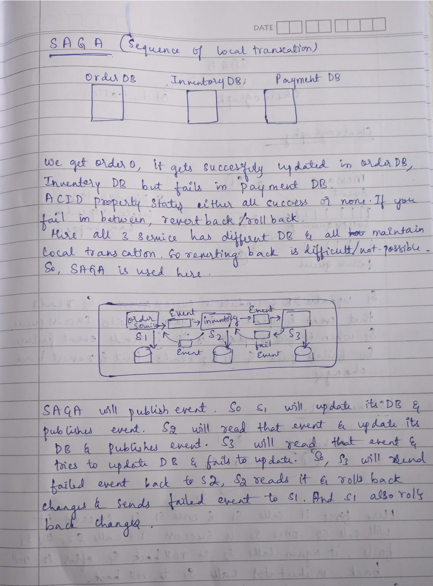
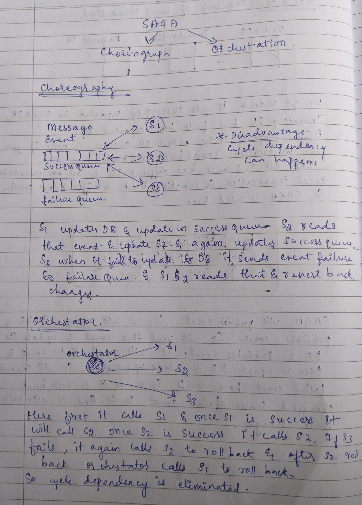

# SAGA Pattern

A Saga is a way to handle a big task (like placing an order) that involves many microservices with separate databases.

Since we can’t use one big database transaction across services, we break the task into smaller steps and add a way to undo each step if something goes wrong.

---

# 🧵 Saga Pattern – Solves Problems with Distributed Transactions

## 🔥 The Problem

In microservices, each service has its own database, so you can’t use a single ACID transaction across services.

For example:

- Create an order
- Reserve inventory
- Charge payment

If one step fails, you need to undo the previous ones.

But there's no simple way to do that across services.

---

# ✅ Saga Solves This By

- Breaking big transactions into smaller steps across services
- If something fails, it runs compensating transactions to undo previous steps
- Ensures eventual consistency instead of strict, immediate consistency

---

# Example Flow

```text
1. Order Service → Create Order
2. Inventory Service → Reserve Product
3. Payment Service → Charge Customer
4. Shipping Service → Start Delivery
```

If Payment fails:

```text
→ Undo Inventory Reservation
→ Cancel Order
```

These undo actions are called:

> Compensating Transactions

---

# 🔄 Two Ways to Run a Saga

---

# 1. Choreography (No Boss)

Each service listens to events and responds automatically.

Like a relay race.

---

## Flow

- Order Service publishes:
  
```text
"OrderCreated"
```

- Inventory Service hears it and reserves item:

```text
"ReserveItem"
```

- Payment Service hears next event and charges card:

```text
"ChargeCard"
```

- If something fails, services publish cancel/rollback events.

---

## Characteristics

- No central controller
- Event-driven communication
- Services react independently

---

## Advantages

✅ Loosely coupled  
✅ Easy to add new services  
✅ Highly scalable

---

## Disadvantages

❌ Harder to debug  
❌ Event chains become complex  
❌ Difficult to track full workflow

---

# Choreography Saga Diagram

<div align="center">



</div>

---

# 2. Orchestration (With a Boss)

One central orchestrator controls the entire workflow.

Like a conductor managing an orchestra.

---

## Flow

- Orchestrator says:

```text
"Order Service, create order"
```

Then:

```text
"Inventory Service, reserve item"
```

Then:

```text
"Payment Service, charge customer"
```

If anything fails:

- Orchestrator tells services to rollback/undo actions.

---

## Characteristics

- Central coordinator exists
- Services follow commands
- Workflow is centrally managed

---

## Advantages

✅ Easier monitoring  
✅ Easier debugging  
✅ Better workflow visibility  
✅ Simpler transaction tracking

---

## Disadvantages

❌ Central orchestrator becomes critical component  
❌ Slightly tighter coupling  
❌ Orchestrator can become complex

---

# Orchestration Saga Diagram

<div align="center">



</div>

---

# Choreography vs Orchestration

| Feature | Choreography | Orchestration |
|---|---|---|
| Central Controller | ❌ No | ✅ Yes |
| Communication Style | Events | Commands |
| Coupling | Loose | Slightly tighter |
| Debugging | Harder | Easier |
| Workflow Visibility | Low | High |
| Scalability | High | Good |
| Complexity | Distributed complexity | Centralized complexity |

---

# Important Concept: Eventual Consistency

Saga does NOT provide immediate consistency like traditional database transactions.

Instead, it provides:

> Eventual Consistency

Meaning:

- Services may temporarily have inconsistent data
- But eventually all services become consistent

---

# Simple Analogy

Imagine booking a vacation:

1. Book flight ✈️
2. Book hotel 🏨
3. Book cab 🚕
4. Make payment 💳

If hotel booking fails:

- Cancel flight
- Refund payment

That rollback behavior is exactly how Saga works.