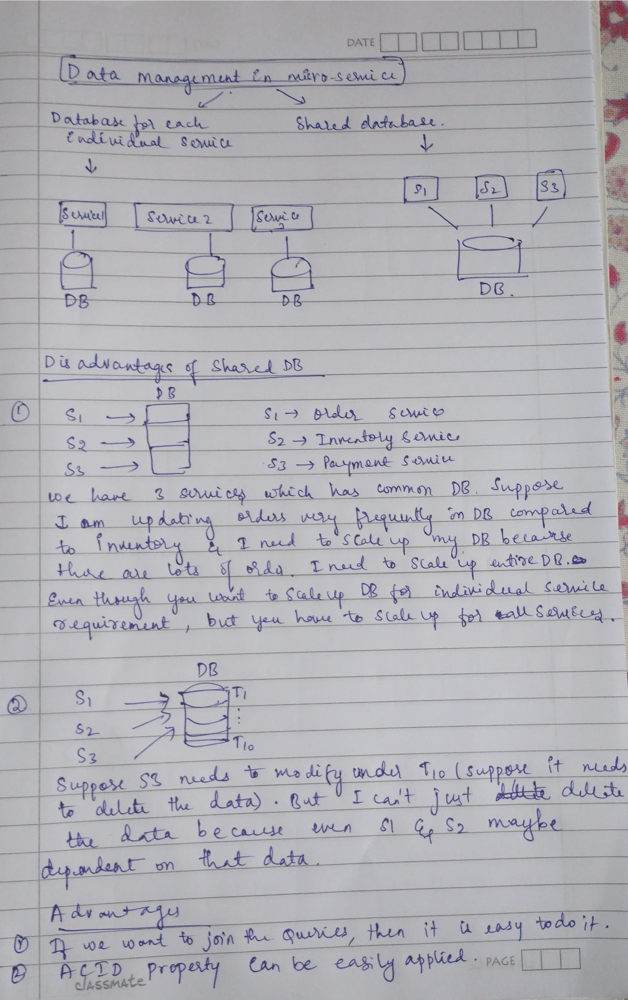
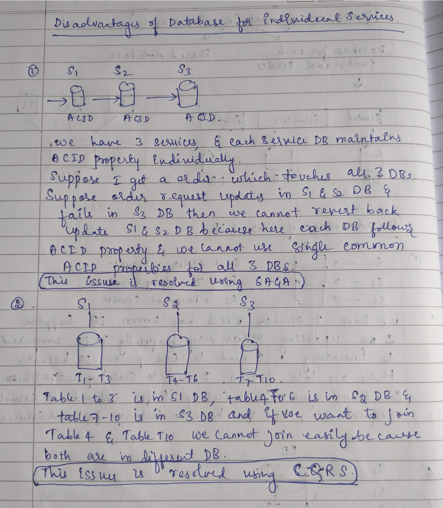

# Strangler Pattern

Instead of replacing the entire legacy system in one go (which is risky and expensive), the Strangler Pattern allows you to incrementally replace parts of the legacy system with new components.

The Strangler Design Pattern is commonly used to refactor a monolithic application into microservices, step by step, without rewriting everything at once.

---

# 🏗️ How Strangler Pattern Helps in Monolith to Microservice Transition

Here’s how it works in that context:

---

## 1. Start with the Monolith

You have a large, tightly-coupled monolithic application.

---

## 2. Place a Facade / API Gateway in Front

Introduce a gateway or facade layer that intercepts incoming requests.

It decides whether to route the request to:

- The existing monolith, or
- A new microservice that replaces a part of the monolith

---

## 3. Extract One Functionality

Pick a well-defined, low-dependency part of the monolith — like:

- User Management
- Inventory

Then:

- Create a new microservice for it.
- Redirect only that functionality’s traffic to the new microservice.

---

## 4. Repeat Gradually

Keep migrating other parts like:

- orders
- payments
- notifications

into microservices.

Over time:

- Slowly "strangle" the monolith.
- The monolith becomes smaller or completely obsolete.

---

# Request Flow in Strangler Pattern

In a Strangler pattern, your API Gateway or Controller acts like a traffic router, deciding whether a request should go to:

- The legacy monolith, or
- The new microservice

---

# 🛠 Scenario

1. Let's say `/user/register` is now handled by a microservice.
2. But the microservice fails or returns an error.
3. The controller detects this failure.
4. It routes the request back to the monolith (if the legacy code is still intact).
5. Once the microservice is fixed, traffic can be routed to it again.

This is often called a:

> Circuit Breaker Pattern

used together with the Strangler Pattern for resilience.

---

# Architecture Diagram

---

# Two Main Approaches in Microservice Database Management

---

# Case 1: Shared Database

## “All services have the same DB”

- There is one single database instance.
- All services (S1, S2, S3) connect to the same DB.
- Tables for all services live in that same DB.

---

## Problems with Shared Database

- Tight coupling between services
- Schema changes affect multiple services
- Difficult independent deployment
- Harder scalability
- Less service ownership

---

# Shared Database Diagram

---

# Case 2: Separate Database Per Service

## “Each service has its own DB”

- Every microservice owns its own database.
- Other services cannot directly access another service’s database.
- Communication happens only through APIs/events.

---

## Advantages

- Better service isolation
- Independent scaling
- Independent schema changes
- Better fault isolation
- True microservice independence

---

## Challenges

- Distributed transactions become difficult
- Data consistency is harder
- Cross-service reporting becomes complex

---

# Separate Database Diagram

