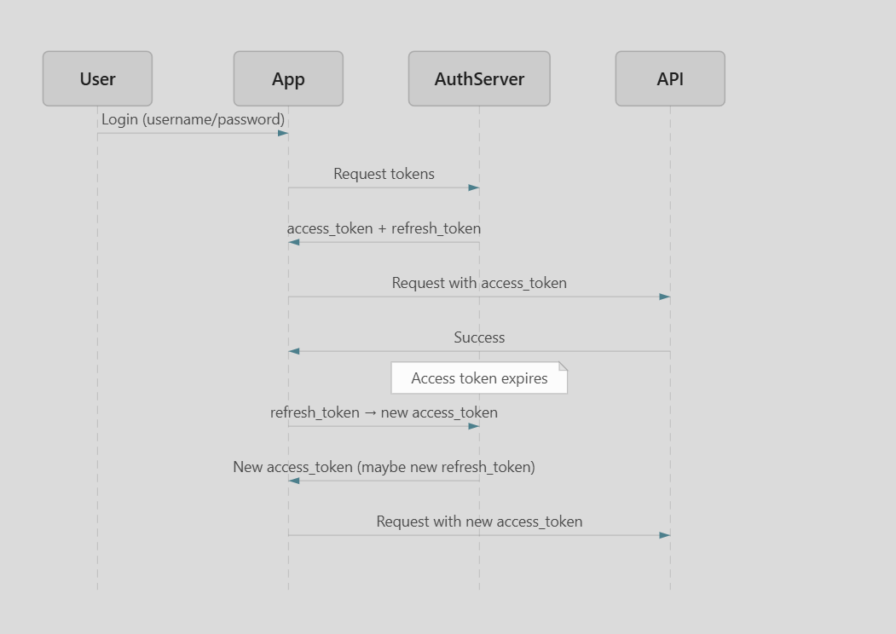

# Access Token vs Refresh Token

Access tokens and refresh tokens are two different credentials used together in modern authentication (especially OAuth 2.0). They solve different problems.

---

## Access Token

An access token is a credential that a client sends with API requests to prove that the user is authenticated.

### Characteristics

- **Short-lived** (e.g., 5–60 minutes)
- Contains user identity and permissions
- **Where it goes:** Usually sent on every API request
- **Typical format:** Often a JWT (JSON Web Token), but not always

### Example

```http
GET /api/orders
Authorization: Bearer eyJhbGciOi...
```

### Why Short-Lived?

If stolen, the attacker has limited time to use it.

- **Risk window** = token lifetime
- A 15-minute stolen token is much less dangerous than a token valid for 30 days

---

## Refresh Token

A refresh token is used to obtain new access tokens without forcing the user to log in again.

### Characteristics

- **Long-lived** — days, weeks, or months (sometimes with rotation)
- **Used for:** Talking to the auth server's token endpoint — not your normal business APIs
- **More sensitive** than access tokens

### Why It Exists

Without it, users would have to log in again every time the access token expires. Refresh tokens keep sessions alive without re-entering passwords.

### Security

Refresh tokens should be stored carefully:

- **Web:** `httpOnly` secure cookie
- **Mobile:** Secure storage (Keychain / Keystore)

Never send refresh tokens to random third-party APIs.

---

## Why Not Just Use a Long-Lived Access Token?

Interviewers often ask this.

### Bad Design

```text
Access Token = 30 days
```

**Problems:**

- If stolen, attacker gets 30 days of access
- Hard to revoke
- Larger security risk

### Better Design

```text
Access Token  = 15 min
Refresh Token = 30 days
```

**Benefits:**

- Small attack window
- Better security
- Better user experience

---

## What Happens If Tokens Are Stolen?

### Attacker Steals an Access Token (15 min)

They can use the API until it expires.

After 15 minutes:

```http
401 Unauthorized
```

Attack ends.

### Attacker Steals a Refresh Token (30 days)

They can continuously obtain new access tokens:

```text
Refresh Token
    ↓
New Access Token
    ↓
Refresh Token
    ↓
New Access Token
```

Potentially for weeks.

That's why refresh tokens require extra protections (rotation, secure storage, revocation).

---

## Summary

| | Access Token | Refresh Token |
|---|---|---|
| **Lifetime** | Short (minutes) | Long (days/weeks) |
| **Sent to** | Business APIs | Auth server only |
| **Purpose** | Prove identity per request | Get new access tokens |
| **If stolen** | Limited damage window | Can renew access for weeks |

---

## Flow Diagram

<div align="center">
  
</div>

## How Systems Protect Refresh Tokens

### Store in HttpOnly Secure Cookies

Instead of:

```javascript
localStorage.setItem("refreshToken", token)
```

Use:

```http
Set-Cookie:
refresh_token=...
HttpOnly
Secure
SameSite=Strict
```

Benefits:

* JavaScript cannot read it.
* XSS attacks cannot directly steal it.
* Sent only over HTTPS.


