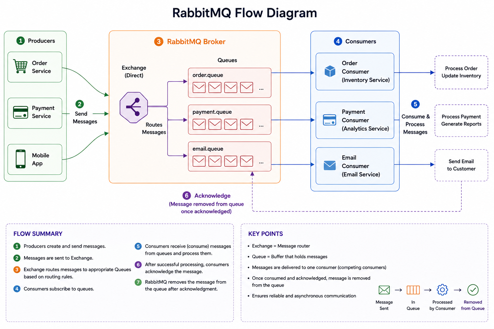
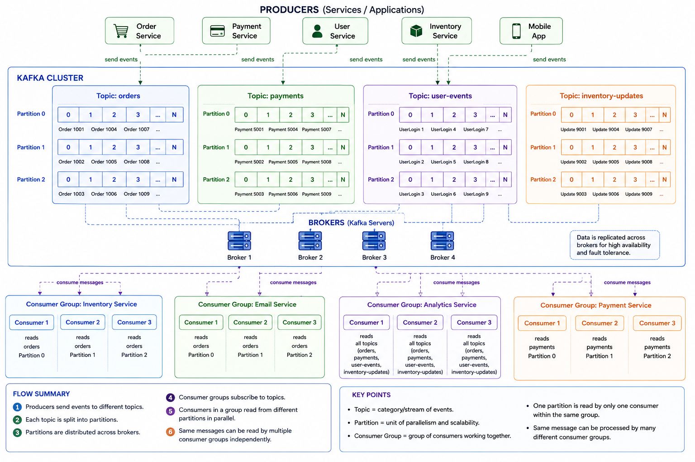

# What is Kafka and RabbitMQ?

Both Kafka and RabbitMQ are message brokers (or messaging systems).

They help different applications/services communicate with each other asynchronously.

Instead of one service directly calling another service, they send messages through Kafka or RabbitMQ.

---

## 🛒 E-Commerce System Without Kafka/RabbitMQ

Imagine you order a phone from an online shopping app.

The moment you click "Place Order" many things must happen:
```
- Order Service creates the order
- Payment Service charges money
- Inventory Service reduces stock
- Email Service sends confirmation
- Analytics Service records user activity
```

### ❌ Problem: Direct Communication Between Services

Suppose every service talks directly to every other service.

It looks like this:

```text
Order Service
   ├── calls Payment Service
   ├── calls Email Service
   ├── calls Inventory Service
   └── calls Analytics Service
```

This creates tight coupling.

**Order Service**, **Payment Service**, **Email Service**, **Inventory Service**, **Analytics Service**

### 🧠 What is Tight Coupling?

Tight coupling means:

- One service becomes heavily dependent on others.

If one service has a problem, everything gets affected.

---

### 🚨 Real Problems in Direct Communication

### **If One Service Fails → Entire Flow Fails**

### Example:

```text
┌──────────────────────────────────────────┐
│ Order Service → creates the order        │
│ Payment Service → charges money          │
│ Inventory Service → reduces stock        │
│ Email Service → sends confirmation       │
│ Analytics Service → records user activity│
└──────────────────────────────────────────┘
```

Suppose Email Service is down.

Now Order Service may:
```
- wait forever
- throw error
- fail the whole order
```
But email is not even critical!

Customer payment succeeded, but because email failed:
```
- order may fail
- user gets error
```
This is bad system design.

---

### 🧱 Failures Spread Easily

This is called cascading failure — one broken service affects many others.

### Example:
```
Email Service down
      ↓
Order Service stuck
      ↓
Users cannot place orders
```
A small issue becomes a big outage.

### 📈 Scaling Becomes Hard

Suppose during a sale: 10 lakh users place orders.

Now:
```
- Order Service gets overloaded
- It directly overloads Payment, Email, Inventory
```
Everything gets stressed together.

Scaling becomes complicated because all services depend on each other in real time.

---

## ✅ Solution: Use Kafka or RabbitMQ

Instead of direct communication, services send messages to a messaging system.

### 🔄 New Architecture
```
Order Service
      ↓
Message Queue / Kafka
      ↓
Other Services read messages independently
```

### 📦 What Actually Happens?

When user places order, Order Service says: "New order created" — this message goes into Kafka/RabbitMQ.

Now:
```
- Payment Service reads it
- Email Service reads it
- Inventory Service reads it
- Analytics Service reads it
```
independently.

---

### ✅ Why This Is Better

### 1. Services Become Independent

Order Service does NOT care:
```
- who reads message
- when they read it
- whether they are temporarily down
```

It simply publishes event: "Order Created" and is done.

### 2. Failure Isolation

Suppose Email Service crashes.
```
- ✅ Payment still works
- ✅ Orders still work
- ✅ Inventory still updates
```

Only emails are delayed.

### 3. 📬 Queue Stores Messages Safely

RabbitMQ/Kafka temporarily store messages. If Email Service is down, message waits in queue and processes when it comes back.

### 4. 📈 Easier Scaling

During high load, add more consumers or instances (e.g., multiple Email Service instances) to process messages in parallel.

---

## 🏗️ Final Architecture Example

```text
              User Places Order
                       ↓
                Order Service
                       ↓
              Kafka / RabbitMQ
         ┌─────────┼─────────┐
         ↓         ↓         ↓
   Payment     Email     Inventory
   Service     Service     Service
```

This is called Event-Driven Architecture / Asynchronous Communication.

---

# RabbitMQ

## 📦 How RabbitMQ Works

RabbitMQ is mainly a message queue system. It works like:
```
Producer → Exchange → Queue → Consumer
```

### 🧠 Components in RabbitMQ

### 1. Producer

- The application sending messages (e.g., Order Service).

### 2. Exchange

- RabbitMQ first receives messages through an Exchange.
- The exchange decides which queue should get this message — like a traffic controller.

### 3. Queue

- Messages wait inside queues (e.g., Email Queue, Payment Queue).

### 4. Consumer

- Consumers read messages from queues (e.g., Email Service reads Email Queue).

### 🧠 Important RabbitMQ Concepts

```
- ACK (Acknowledgement): Consumer tells RabbitMQ "I processed this successfully".
Only then the message gets removed.
If consumer crashes before ACK, the message is not deleted and RabbitMQ may redeliver it.
```
### 📬 RabbitMQ is Great For

```
- Task queues
- Background jobs
- Email sending
- OTP processing
- Order workflows
```

### Why use an Exchange?

Without exchange:
```
Producer → Queue
```
Producer must know exact queue name and routing logic, which creates tight coupling.

With exchange:
```
Producer → Exchange → Queue
```

```
Producer only sends to exchange, which decides which queue(s) receive the message based on rules. 
This adds flexibility, loose coupling, and dynamic routing.
```
<p align="center">
  
</p>

---

# Kafka

## What is Kafka?

Apache Kafka is a distributed event streaming platform. Kafka stores and streams events/messages between applications at massive scale.

### 📦 What is an Event?

An event is simply "something happened" — e.g., user placed order, payment succeeded, user clicked ad.

Kafka stores these events continuously.

### 🏗️ Why Kafka Was Created

```
Companies like 
LinkedIn,
Netflix,
Uber
generate millions of events per second. 
Kafka handles huge scale, real-time processing, event history, and multiple consumers.
```
---

### Core Idea of Kafka

Kafka works like a distributed event log — a giant continuously growing log file that appends events.

### ⚡ Kafka Main Components

### 1. Producer
- Producer sends events to Kafka (e.g., Order Service sends "Order Created").

### 2. Topic
- Kafka stores events inside Topics (categories of events) such as `orders`, `payments`, `notifications`, `user-clicks`.

### 3. Partition
- Each topic is split into partitions (e.g., Partition 0, Partition 1, Partition 2). Partitions enable parallelism and scalability.

### 4. Broker
- A Kafka server is called a Broker. Multiple brokers form a Kafka Cluster for fault tolerance and high availability.

### 5. Consumer
- Consumers read events from Kafka (e.g., Analytics Service, Fraud Detection, Inventory Service).

---

## 🔄 How Kafka Works Step-by-Step

### Example: E-Commerce Order

### 1. Producer Sends Event

- Order Service sends "Order Created" to Kafka Topic `orders`.

### 2. Kafka Stores Event

- Kafka appends event to a partition. Offsets indicate position (e.g., Offset 0, Offset 1).

### 3. Consumers Read Events

- Multiple services can independently read the same event without affecting each other.


### 🧠 What is Offset?

- Offset = position of an event inside a partition (like a line number).

### 🔥 Important Difference from RabbitMQ

- RabbitMQ usually removes a message after processing.
- Kafka does not immediately delete messages. Kafka retains events for a configured duration (hours/days/weeks).

### Topic vs Partition

- A Topic is a category/channel where events are stored.
- Each Topic is divided into Partitions for parallel processing.

Does the same event go to all partitions?

- ❌ No — the same event does NOT go to all partitions. Each event goes to only one partition inside a topic. This is for parallelism and scalability.

### Example Partitioning

If `orders` topic has 3 partitions, events might be distributed:
```
- Partition 0 → Order A
- Partition 1 → Order B
- Partition 2 → Order C
- Partition 0 → Order D
```
This enables high throughput and parallel consumers.

---

## Consumers and Parallelism

<p align="center">
  
</p>
