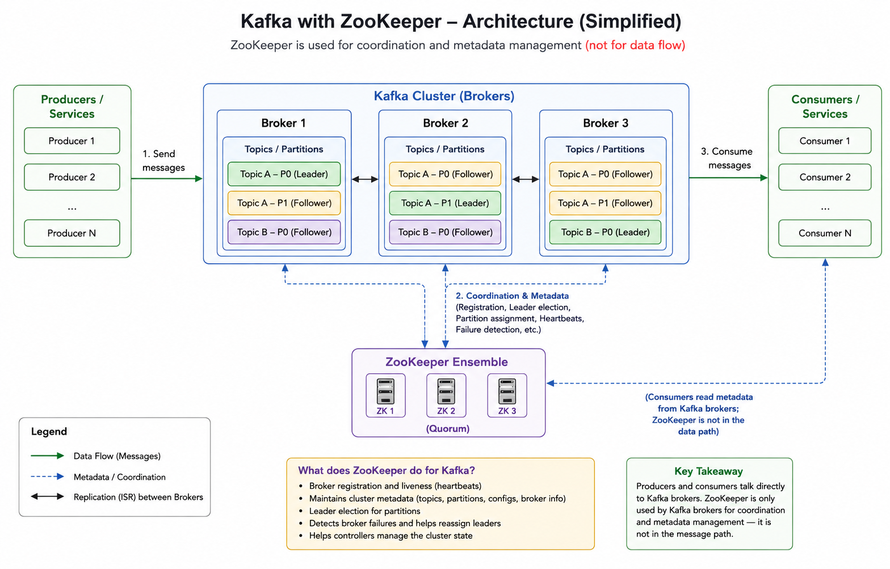

# What is Apache ZooKeeper?

Think of ZooKeeper as a central coordinator for distributed systems.

When many servers are working together, they need help answering questions like:

- Who is the leader?
- Which servers are alive?
- Where is configuration stored?
- How do services discover each other?
- How do we avoid two servers doing the same job?

ZooKeeper solves these coordination problems.

Apache ZooKeeper is like a:

- Central coordination registry for distributed systems

It stores:

- service information
- metadata
- leader info
- configuration
- health/presence of servers

using a structure similar to a filesystem.

Example:

```
/services/payment/server1
/services/payment/server2
/config/db_url
/leader
```

These are called ZNodes.

ZooKeeper does NOT store:

- actual business data
- large files
- user records
- images/videos
- database tables

It stores only:

- coordination data
- tiny metadata
- state information

Usually each znode contains just a few bytes or KBs.

Apache ZooKeeper does not automatically discover services by scanning the network.

Instead:

- Services themselves connect to ZooKeeper and register their information.

## How It Actually Works

Suppose a service starts:

`payment-service instance-1`

When it boots up:

- It opens a TCP connection to ZooKeeper
- It creates a znode like:
  - `/services/payment/instance-1`
- It stores metadata:

```json
{
  "ip": "10.0.0.5",
  "port": 8080
}
```

So ZooKeeper knows:

- "This service is alive."

## Important Architecture Understanding

ZooKeeper is:

- not a network scanner
- not polling services continuously
- not pinging every machine

Instead:

- services maintain a live session with ZooKeeper

## How ZooKeeper Detects Failure

Usually services create:

- Ephemeral ZNodes

These nodes exist only while the service session is alive.

If:

- server crashes
- network disconnects
- process dies

then:

- ZooKeeper session expires
- znode disappears automatically

Example:

- `/services/payment/instance-1`

gets deleted automatically.

Other systems watching that node immediately know:

- "Payment instance-1 is gone."


## Master Election

Yes, ZooKeeper helps elect a leader/master.

Example:

Suppose you have:

- 5 worker servers

Only one should coordinate tasks.

ZooKeeper helps:

- all servers compete for leadership
- one becomes leader/master
- others become followers
- if leader dies → ZooKeeper elects new one

This is called:

- Leader Election

## Service Details

Yes — services can register themselves in ZooKeeper.

Example:

```
/services/order-service/instance1
/services/order-service/instance2
```

Each node may store:

- IP address
- port
- status
- timestamp

Other services read ZooKeeper to discover them.

This is:

- Service Discovery

## One More Important Thing

ZooKeeper also tracks whether services are alive.

It does this using:

- Ephemeral Nodes

If a service crashes:

- connection to ZooKeeper breaks
- its node is automatically removed

So everyone knows:

- "This server is dead."

## Distributed Locking

Sometimes only one server should execute a task.

Example:

- Only one payment server should process refund #123

ZooKeeper provides locks to prevent duplicate work.

## Configuration Management

Instead of storing configs on every server:

- db_host = x.x.x.x

Store centrally in ZooKeeper.

When config changes:

- ZooKeeper notifies all servers automatically.

## Important Concepts

### ZNode

ZooKeeper stores data in nodes called ZNodes.

Looks like a filesystem:

```
/app
/app/config
/app/leader
```

Each znode stores:

- small data
- metadata
- children

### Ephemeral Nodes

Temporary nodes.

If a server disconnects:

- ZooKeeper automatically deletes its node.

Useful for:

- heartbeat
- service availability

Example:

- /services/payment/server1

If server1 crashes → node disappears.

### Watchers

Clients can "watch" a znode.

If data changes:

- ZooKeeper sends notification.

Example:

- watch /leader

If leader changes:

- all servers are notified immediately.

## Architecture

ZooKeeper runs as a cluster.

Example:

- 3 or 5 ZooKeeper servers

One becomes:

- Leader

Others:

- Followers

Majority voting ensures consistency.

## Why Odd Number of Servers?

Because ZooKeeper uses quorum (majority agreement).

Example:

- 3 servers → need 2 alive
- 5 servers → need 3 alive

Odd numbers avoid split votes.

## CAP Theorem Position

ZooKeeper prefers:

- Consistency
- Partition Tolerance

It sacrifices some availability during network partitions.

So ZooKeeper is basically CP in CAP theorem.

