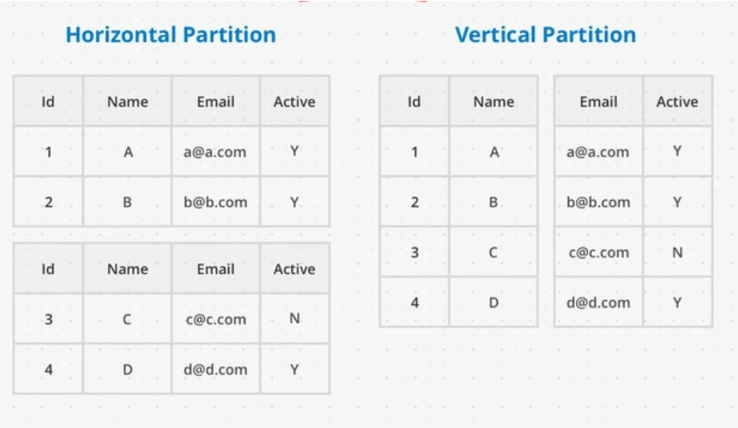

# 🏗️ What is Database Scaling?

Database scaling means making your database handle more users, more data, or more traffic without slowing down or crashing.

Imagine a small restaurant:  
- If a few people come in, service is fast.  
- But if 1,000 people show up, you need more tables, more staff, or a bigger kitchen.  

Same idea with databases — as demand grows, you have to scale.

---

# ⚙️ Two Main Types of Scaling

## 1. Vertical Scaling (Scaling Up)

Make one database server more powerful.

- Add more CPU, RAM, or storage.  
- Easy to do, but has limits (there’s only so big a server can get).

### ✅ Advantages
- Simple  

### ❌ Disadvantages
- Expensive at some point  
- Single point of failure  

---

## 2. Horizontal Scaling (Scaling Out)

Add more servers to handle the load.

- Spread the data and traffic across multiple database machines.  
- More complex, but more powerful.

### ✅ Advantages
- More scalable  
- Better fault tolerance  

### ❌ Disadvantages
- Harder to manage  

---

# 🍰 What is Sharding?

Sharding means splitting a large database into smaller parts, called shards, so it’s easier and faster to manage.  
Each shard holds just a portion of the data.

---

## 💡 Why do we shard?

When your database gets too big or too busy, one server can’t handle it all.  
Sharding spreads the load across multiple machines.

---

## 🔹 1. Horizontal Sharding (Most common)

Split data by rows — each shard holds some of the rows of a table.

### Example:

You have a users table with 10 million users.

- Shard 1: users with IDs 1–3 million  
- Shard 2: users with IDs 3M–6M  
- Shard 3: users with IDs 6M–10M  

### ✅ Advantages
- Good for large datasets  

### ❌ Disadvantages
- Hard to do joins across shards  

---

## 🔹 2. Vertical Sharding

Split data by columns — each shard holds different parts of the data (different tables or columns).

### Example:

- Shard 1: user account data (username, password, email)  
- Shard 2: user profile data (bio, photos, preferences)  

### ✅ Advantages
- Easier to manage specific data types  

### ❌ Disadvantages
- Some queries may need to join data across shards  

---

---

# ❌ The main disadvantages of sharding, explained simply:

---

## ❌ 1. Complexity

Sharding makes your system more complicated to build, manage, and debug.

- You have to write logic to figure out which shard to use.  
- Backups, monitoring, and maintenance become more involved.  
- Devs need to think about data distribution.  

---

## ❌ 2. Hard to Query Across Shards

You can’t easily run JOINs, aggregates, or searches across multiple shards.

- Example: Counting all users across all shards? You must query each shard separately, then combine the results.  
- JOINs across shards = pain 😫  

---

## ❌ 3. Rebalancing is Hard

If one shard gets too much data or traffic, you may need to:

- Move data between shards  
- Update shard keys or ranges  
- Possibly reshard everything (which is slow and risky)  

This is called the rebalancing problem.

---

## ❌ 4. Single Point of Failure (if not done right)

If your shard lookup service (e.g., directory or router) fails, your whole system may go down.  
Also, if one shard crashes and holds critical data, it can affect the whole app.

---

## ❌ 5. Data Skew

Some shard strategies (like range sharding) can lead to uneven data distribution.

- One shard may be huge or busy  
- Others may be nearly empty  

This causes hotspots and defeats the purpose of scaling.

---

## ❌ 6. More Effort in Transactions

Multi-shard transactions are tricky:

- Example: Transferring money from a user in Shard A to one in Shard B  
- You need distributed transactions or two-phase commits (adds complexity and slowness)  

---

## ❌ 7. Testing & Development Become Harder

In development:

- Simulating a multi-shard system is harder  

---

# 🌍 Real-World Applications

Sharding is commonly used in large-scale applications and databases, including:

- → Web Applications: Social media platforms, e-commerce sites, and any application with millions of users often utilize sharding to handle their vast amounts of user data.  
- → NoSQL Databases: Many NoSQL databases, like MongoDB and Cassandra, are designed to support sharding natively.  
- → Distributed Databases: Systems that require high availability and scalability, such as Amazon DynamoDB and Google Cloud Spanner, often implement sharding as part of their architecture.  