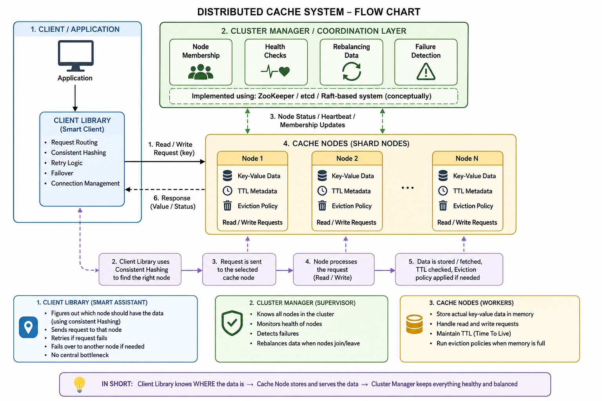

# What is a Distributed Cache?

A distributed cache is a caching system where cached data is stored across multiple servers (nodes) instead of a single machine.

All these cache nodes work together as one logical cache, so applications can store and retrieve data quickly at scale.

Common examples include:

- Redis
- Memcached

**A distributed cache is NOT “each distributed server having its own separate cache”. It is something different.**

---

## ✅ What it actually means

In a distributed cache, you have a separate cache cluster made of multiple cache nodes.

Your application servers do not each maintain independent cache copies.

Instead:

- All app servers talk to the same cache system  
- That cache system is distributed across multiple nodes  

---

#### ❌ NOT this (wrong assumption)

Each server has its own cache:
```
App Server A → Cache A  
App Server B → Cache B  
App Server C → Cache C  
```
Problem: data inconsistency + duplication + hard to sync  

---

#### ✅ ACTUAL distributed cache
```
App Server A \  
App Server B  → Distributed Cache Cluster (Redis/Memcached)  
App Server C /  
```
Inside the cache cluster:
```
Cache Node 1  
Cache Node 2  
Cache Node 3  
```
The system decides where data lives.

---

## 🧠 Typical real-world setup

You usually have:

- Multiple application servers (behind a load balancer)
- One shared distributed cache cluster (like Redis or Memcached)
- A database (MySQL, PostgreSQL, etc.)

And the flow looks like this:
```
Client → Load Balancer → App Server (any one)  
                           ↓  
                    Distributed Cache  
                           ↓ (if miss)  
                        Database  
```

---

# Requirements

## Functional Requirements

- Store key-value pairs  
- Fast GET / PUT operations  
- Support TTL (time-to-live) expiry  
- High availability  
- Horizontal scalability  
- Optional: replication, persistence  

---

## Non-Functional Requirements

- Low latency (ms or sub-ms)  
- High throughput (millions of ops/sec)  
- Fault tolerance  
- Eventual or configurable consistency  

---

# High-Level Architecture
```
Client  
  |  
  |  (cache request)  
  v  
Cache Router / Load Balancer  
  |  
  v  
+-----------------------------+  
|  Distributed Cache Cluster  |  
|                             |  
|  Node A   Node B   Node C   |  
|   |         |        |      |  
|   +---------+--------+      |  
|         Replication         |  
+-----------------------------+
```
---

# Core Components

## 1. Cache Nodes (The “Workers”)

These are the machines that actually store your data.

Think of them like memory boxes.

Each cache node:

- Stores data as key → value pairs (e.g., user123 → profile_data)  
- Handles read and write requests  
- Keeps track of TTL (Time To Live) → how long data stays valid  
- Removes old data using eviction policies (like removing least-used items when memory is full)  

👉 In short:  
Cache nodes = where the data lives and gets served from  

---

## 2. Cluster Manager / Coordination Layer (The “Supervisor”)

This is the system that manages all cache nodes.

It doesn’t store data. Instead, it ensures the system runs smoothly.

It handles:

- Node membership → which nodes are part of the cluster  
- Health checks → which nodes are alive or dead  
- Rebalancing → redistributing data when nodes are added/removed  
- Failure detection → spotting crashed nodes quickly  

It is often built using tools like:

- ZooKeeper  
- etcd  
- Raft-based systems  

👉 In short:  
Cluster manager = the brain that keeps all nodes organized and healthy  

---

## 3. Client Library (The “Smart Assistant”) ⭐ Very Important

This runs inside your application and talks to the cache cluster.

Instead of a central server handling everything, each app instance uses this library.

It handles:

- Routing requests → figures out which cache node has the data  
- Consistent hashing → ensures keys are evenly distributed across nodes  
- Retries → tries again if a request fails  
- Failover → switches to another node if one is down  

👉 In short:  
Client library = the smart GPS that knows where data is stored  

---

## 🧭 Cache Workflow

<p align="center">
  
</p>

---

## ✅ Step-by-step request flow

### 1. Client sends request

Your application (e.g., service code) wants data:
`get(user123)`


---

### 2. Client Library handles everything (important part)

The request first goes to the Client Library (Smart Client).

### It does 3 key things:

---

### a) Consistent Hashing

It calculates:
`hash(key) → determines which cache node owns the key`
- Example:

`user123 → Node 3`

---

### b) Routing

Sends request directly to that node:
`Client → Cache Node 3`

---

### c) Retry / Failover

If Node 3 is down:

- Try Node 4 or next replica  
- Or recompute based on cluster state  

---

## ❌ Cluster manager does NOT sit in request path

It does NOT:

- handle reads/writes  
- store data  
- receive every request  

---

## ✅ What it actually does

Think of it as background control system:

- Tracks which nodes are alive  
- Adds/removes nodes from cluster  
- Helps update hashing ring info  
- Triggers rebalancing when nodes change  
- Detects failures    

---
# Distributed Cache – Core Concepts (Sharding + Replication + Strategies)

---

# 📦 Data Distribution (Sharding)

## ❗ Problem
We cannot store all data in one node.

---

## ✅ Solution: Consistent Hashing

### 💡 How it works:
- Hash both:
  - cache keys  
  - cache nodes  
- Place nodes on a **hash ring**  
- Key is stored in the **nearest clockwise node**

---

## 🚀 Benefits:
- Minimal rebalancing when nodes are added/removed  
- Scales smoothly  
- Avoids full remapping of keys  

---

# 🔁 Replication (High Availability)

## 💡 Goal:
Avoid data loss when a node fails.

---

## 🧭 Strategy:
Each key is stored in:
- Primary node  
- 1–2 replica nodes  

---

## ✍️ Write Flow:
`App → Primary Node → Async replication → Replica nodes`

---

## ⚠️ Failure Handling:
- If primary fails → replica is promoted to primary  
- System continues serving requests without downtime  

---

## ⚖️ Trade-off:
- Slight consistency lag due to async replication  
- But ensures high availability and fault tolerance  

---

# ⚡ Caching Strategies

---

## 1. Cache Aside (Lazy Loading) ⭐ Most Common

### 💡 Idea:
Application manages the cache.

---

### 🧭 Flow:

- **Read:**
`App → Cache (miss) → DB → Cache → App`
- **Write:**
`App → DB → invalidate/update cache`


---

### 🧠 How it works:
- App checks cache first  
- If miss → fetch from DB  
- Store result in cache for future requests  

---

### 👍 Pros:
- Simple  
- Efficient for read-heavy systems  
- Cache stores only hot data  

---

### 👎 Cons:
- First request is slow (cache miss)  
- Risk of stale data if not properly invalidated  

---

## 2. Read Through Cache

### 💡 Idea:
Cache automatically loads data from DB when needed.

---

### 🧭 Flow:
`App → Cache → (Cache fetches DB on miss) → App`

---

### 🧠 How it works:
- Application only talks to cache  
- Cache is responsible for fetching from DB  

---

### 👍 Pros:
- Cleaner application logic  
- Cache acts as smart abstraction layer  

### 👎 Cons:
- More complex cache implementation  
- Still has cache miss latency  

---

## 3. Write Through Cache

### 💡 Idea:
Every write goes to both cache and database.

---

### 🧭 Flow:
`App → Cache → DB (synchronous write)`

---

### 🧠 How it works:
- Cache and DB are updated together  
- Ensures strong consistency  

---

### 👍 Pros:
- Cache always consistent with DB  
- No stale reads  

### 👎 Cons:
- Slower writes (double write latency)  
- Wastes cache for rarely read data  

---

## 4. Write Back (Write Behind) Cache

### 💡 Idea:
Write happens only in cache first, DB updated later asynchronously.

---

### 🧭 Flow:
`App → Cache → DB (async background write)`

---

### 🧠 How it works:
- Writes are fast (only cache update)  
- Background process syncs DB later  

---

### 👍 Pros:
- Very fast write performance  
- Reduces database load significantly  

### 👎 Cons:
- Risk of data loss if cache crashes before sync  
- Complex failure recovery  

---

## 5. Refresh Ahead Cache

### 💡 Idea:
Cache refreshes data before it expires.

---

### 🧭 Flow:
```
App → Cache (always fresh data)
↓
Background refresh before expiry
```
---

### 🧠 How it works:
- Cache predicts expiring keys  
- Refreshes them in background proactively  
- Users rarely face cache misses  

---

### 👍 Pros:
- Very low latency  
- Almost zero cache misses  

### 👎 Cons:
- Extra background load  
- May refresh unused data  


---

# Eviction Policies (Short & Simple)

Memory in cache is limited, so old or less useful data must be removed. This is called **eviction**.

---

## 1. LRU (Least Recently Used)

Removes data that was **not used for the longest time**.

- Idea: “If you didn’t use it recently, remove it”
- Best for: general use cases
- Example: old items in browsing history get removed first

---

## 2. LFU (Least Frequently Used)

Removes data that is **used the least number of times**.

- Idea: “If you rarely use it, it’s not important”
- Best for: long-term popularity-based caching
- Example: rarely accessed product data gets removed

---

## 3. TTL (Time To Live)

Removes data after a **fixed time period**, no matter what.

- Idea: “Data expires after time limit”
- Best for: sessions, temporary data
- Example: login session expires after 30 minutes

---

# Handling Cache Misses

## ❗ Problem

Too many cache misses can overload the database, causing a **thundering herd problem** (many requests hitting DB at once).

---

## 1 Request Coalescing

## 💡 Idea:
Only **one request goes to the database**, others wait for the result.

---

## 🧭 How it works:
- First request misses cache → goes to DB  
- Other identical requests are blocked/wait  
- Once result is fetched → shared with all  

---

## 👍 Benefit:
- Prevents duplicate DB calls  
- Reduces load during spikes  

---

## 2 Cache Warming

## 💡 Idea:
Preload cache with frequently used data before users request it.

---

## 🧭 How it works:
- System predicts hot data  
- Loads it into cache during startup or background jobs  

---

## 👍 Benefit:
- Avoids cold starts  
- Reduces initial cache misses  

---

## 3 Stale-While-Revalidate

## 💡 Idea:
Serve old (stale) data immediately, while updating cache in background.

---

## 🧭 How it works:
- Return cached data instantly (even if slightly old)  
- Refresh cache asynchronously in background  

---

## 👍 Benefit:
- Very fast response  
- Keeps system smooth under load  

---

# Multi-Level Cache

Real-world systems use multiple cache layers to balance speed, cost, and scalability.

---

## 🧠 Idea

Instead of relying on one cache, we use multiple levels:

---

## ⚡ L1 Cache (In-Process Cache)

- Lives inside the application server memory  
- Fastest access (no network call)  
- Very small in size  

### 💡 Example:
- Local in-memory cache (HashMap, Caffeine)

### 👍 Pros:
- Ultra-fast (nanoseconds to microseconds)  
- No network overhead  

### 👎 Cons:
- Not shared across servers  
- Limited memory  

---

## 🌐 L2 Cache (Distributed Cache)

- External cache system shared across servers  
- Slightly slower than L1 (network call)  
- Much larger capacity  

### 💡 Example:
- :contentReference[oaicite:0]{index=0}

### 👍 Pros:
- Shared across all app servers  
- Scales horizontally  
- Reduces DB load significantly  

### 👎 Cons:
- Network latency  
- More complex than L1  

---

## 🗄️ L3 (Database)

- Source of truth  
- Slowest compared to cache layers  
- Highly durable and persistent  

### 💡 Example:
- PostgreSQL, MySQL

---

---

## 🚀 What distributed caches choose

Most distributed cache systems (like :contentReference[oaicite:0]{index=0} in cluster mode, Memcached setups, etc.) prioritize:

### ✅ Availability + Partition Tolerance (AP System)

- System always responds  
- Works even during network failures  
- May return slightly stale data  

---

## ⚠️ Trade-off: Eventual Consistency

- Data may not be immediately same across all nodes  
- Updates propagate over time  
- Temporary inconsistency is allowed  

---

## 🧭 Example

1. Write happens on Node A  
2. Node B gets updated later  
3. In between, reads may see old data  

---

---

## 1. How do you handle cache stampede?

A **cache stampede** happens when many requests try to load the same missing key from the database at once, causing DB overload.

### 💡 Solutions:

- **Locks (Single-flight)**
  - Only one request fetches from DB
  - Others wait for result

- **Request Coalescing**
  - Merge multiple identical requests into one DB call

- **Stale Cache (Stale-While-Revalidate)**
  - Serve old data immediately
  - Refresh cache in background

---

## 2. What happens if a cache node goes down?

When a node fails in a distributed cache:

### 💡 System behavior:

- Requests are redirected to other nodes
- **Replica promotion** (if replication exists)
- Data is **rehashed using consistent hashing**
- Temporary cache misses may increase

### 🧠 Key idea:
System should degrade gracefully, not fail completely.

---

## 3. How do you scale to billions of keys?

Scaling requires distributing data efficiently.

### 💡 Techniques:

- **Consistent Hashing**
  - Minimizes data movement when nodes are added/removed

- **Sharding**
  - Splitting data across multiple nodes

- **Tiered Caching**
  - L1 (in-memory)
  - L2 (distributed cache like :contentReference[oaicite:0]{index=0})
  - L3 (database)

---

## 4. How do you ensure cache vs DB consistency?

Caches can become stale, so we need a strategy.

### 💡 Common approach:

- **Cache Aside Pattern (most used)**
  - App checks cache first
  - On miss → fetch from DB → update cache

### 💡 Invalidation strategies:
- Delete cache on write
- TTL-based expiry
- Update cache immediately after DB write (write-through pattern)

---