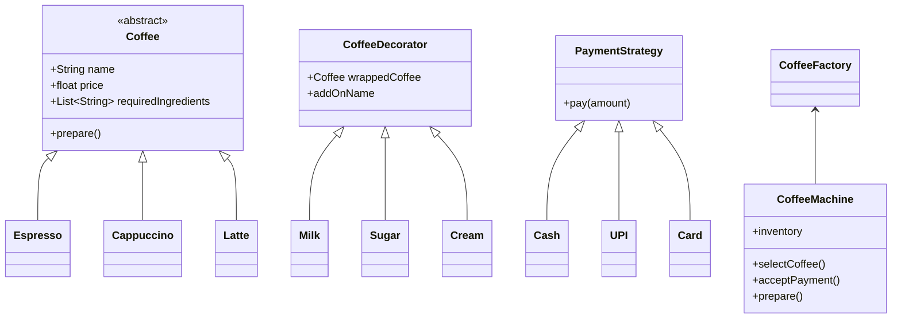

# Design a Coffee Machine

A simple low-level design (LLD) for a coffee machine that supports multiple coffee types, add-ons, and payment methods. The machine checks ingredient availability, accepts payment, prepares the coffee, deducts ingredients, and becomes ready for the next customer.

## Functional Requirements

- Support different coffee types:
  - Espresso
  - Cappuccino
  - Latte

- Each coffee should have:
  - Name
  - Price
  - Required ingredients

- Customer can add optional ingredients (add-ons):
  - Milk
  - Sugar
  - Whipped cream

- Support different payment methods:
  - Cash
  - UPI
  - Credit Card

- Machine flow:
  1. See available coffees
  2. Select a coffee
  3. Add optional ingredients
  4. Pay
  5. Machine checks ingredient availability
  6. Accept payment
  7. Prepare coffee
  8. Deduct ingredients after successful purchase
  9. Maintain machine state and become ready for the next customer

## Non-functional Requirements

- Easy to add a new coffee type
- Easy to add a new payment method
- Easy to add a new coffee add-on
- Classes should follow Single Responsibility Principle
- Avoid large if/else or switch blocks (prefer patterns: Factory, Strategy, Decorator)

## Design Notes

- Use a `Coffee` base class with concrete types: `Espresso`, `Cappuccino`, `Latte`.
- Use the Decorator pattern to add optional ingredients (milk/sugar/cream).
- Use a `PaymentStrategy` interface with implementations for `Cash`, `UPI`, and `Card`.
- Use a `CoffeeFactory` to create coffee objects.
- `CoffeeMachine` orchestrates selection, payment, preparation, and inventory updates.

## Class Diagram (Mermaid)

## Quick Example Sequence

1. Customer checks available coffees on `CoffeeMachine`.
2. Customer selects `Latte` and adds `Milk` and `Sugar` decorators.
3. Customer pays via `UPI` (uses `PaymentStrategy`).
4. `CoffeeMachine` validates inventory, accepts payment, calls `prepare()` on the coffee object, and deducts ingredients from inventory.

---
