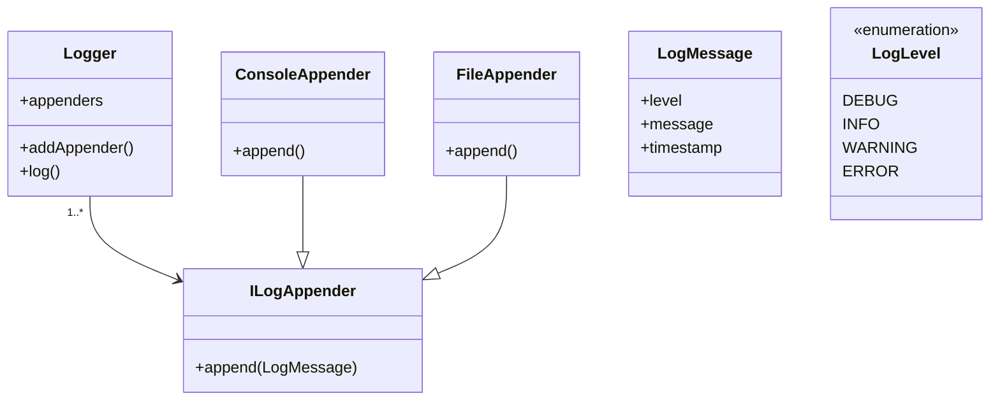

# Logger System — LLD

## What is a Logging System?

A logging system is the mechanism an application uses to record what happens while it runs — think of it as a diary for your software.

### Typical events

When an application runs, many events occur:

- Application starts
- User logs in
- Database request happens
- Payment processed
- Something fails

The logging system records important events like these. Example log lines:

```
[INFO] Server started
[INFO] User logged in
[DEBUG] Sending request to database
[WARNING] Memory usage is high
[ERROR] Database connection failed
```

### Why do we need logging?

Logs provide a historical record so you can investigate issues after they happen. For example, when a user reports "The application stopped working," a log trace might show:

```
10:20:01 [INFO] Server started
10:20:05 [INFO] User logged in
10:20:06 [DEBUG] Connecting to database
10:20:07 [ERROR] Database connection failed
10:20:07 [ERROR] Request failed
```

From this trace it's clear the root cause is a database connection failure.

### Where are logs stored?

Logs can be sent to different destinations depending on needs and environment.

#### Console

Useful during development and debugging; logs are printed to standard output:

```
[INFO] Server started
[ERROR] Database failed
```

#### File

Logs can be written to a file (e.g. `application.log`) so they persist after the process exits:

```
[INFO] Server started
[INFO] User logged in
[ERROR] Database failed
```

#### Database

For structured storage and querying, logs can be stored in a database table:

| Log ID | Level | Message         |
|--------|-------|-----------------|
| 1      | INFO  | Server started  |
| 2      | ERROR | Database failed |


## 1. Requirements

### Functional requirements

We need a logging system that:

- Supports log levels: `DEBUG`, `INFO`, `WARNING`, `ERROR`
- Supports multiple output destinations (appenders): console and file
- A log message should contain: timestamp, log level, and message
- Multiple appenders can receive the same log message

Example usage:

```cpp
logger.log(LogLevel::INFO, "Server started");
logger.log(LogLevel::ERROR, "Database connection failed");
```

When an ERROR is logged it may be delivered to both the console and a file appender.

### Non-functional requirements

- Easy to add new log levels
- Easy to add new appenders
- `Logger` should not depend directly on concrete appenders (follow Open/Closed Principle)
- Avoid duplicating logging logic
- Thread-safety can be considered an extension
- Different appenders may have different minimum log levels (e.g. Console -> DEBUG+, File -> ERROR+)

## 2. Main classes

Suggested classes:

- `LogLevel`
- `LogMessage`
- `ILogger`
- `Logger`
- `ILogAppender`
- `ConsoleAppender`
- `FileAppender`
- `AppenderFactory`

Relationship (high level):

```
        Logger
          |
     has many appenders
       /             \
  ConsoleAppender     FileAppender
```

## 3. Design patterns

This design uses a few classic patterns:

1. Strategy Pattern — each appender implements `ILogAppender` and encapsulates how logs are written.

```
ILogAppender
  |
  +-- ConsoleAppender
  +-- FileAppender
```

2. Factory Pattern — use `AppenderFactory::create(...)` to centralize creation of appenders.

3. Observer-like design — `Logger` acts as the publisher and notifies all registered appenders when a log is produced.

```
       Logger
         |
    notify all appenders
    /             \
   Console         File
```

## 4. Class diagram (mermaid)



## 5. Notes

- Appenders may enforce a minimum level before writing a log.
- Keep creation logic in `AppenderFactory` to decouple `Logger` from concrete appender types.
- Consider adding thread-safety and async buffering for high-throughput scenarios.
